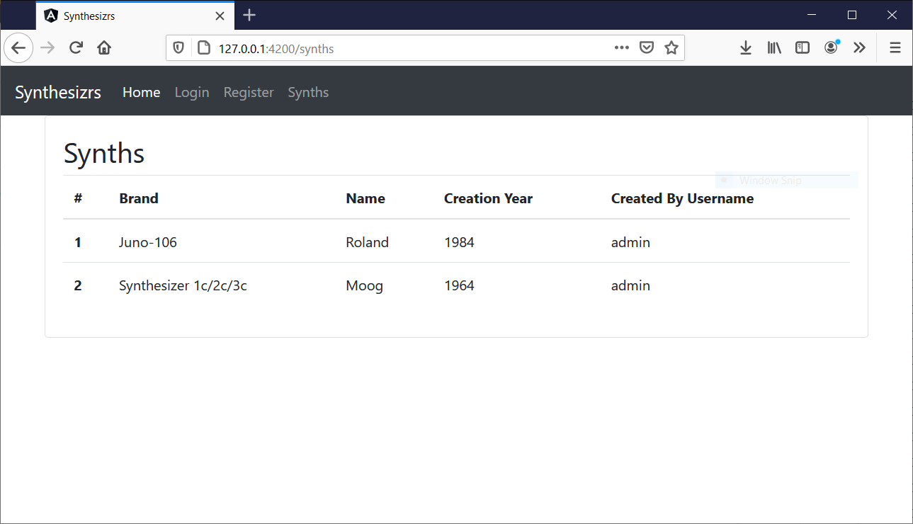

# Workshop 4 - Création d'un page de contenu authentifiée

Maintenant qu'on a une page login avec [Workshop 3 : Création d'une page de login (ajout authentification)](3-login), on peut maintenant afficher du contenu aux utilisateurs loggué !



## Ajouter du contenu dans le backend

Maintenant que vous avez un backend et une base de donnée, vous pouvez aussi commencer à y ajouter du contenu. Example: ajouter une table "synthesizers" qui contient des synthetiseurs, pour pouvoir les affichers aux utilisateurs.

Vous allez devoir lier chaque entités avec l'utilisateur : cela aura pour but d'afficher à un utilisateur que son contenu, ou aux autres utilisateurs de chercher du contenu pour un utilisation en particulier.

### Java / Spring Boot

- Créer une nouvelle entitée (noter la clef étrangère vers un `User`)
    ```java
    @Entity(name = "synthesizers")
    public class Synthesizer {
    
        @Id
        @GeneratedValue(strategy = GenerationType.IDENTITY)
        private long id;
    
        @Column
        private String brand;
    
        @Column
        private String name;
    
        @Column
        private String creationYear;
    
        @ManyToOne
        @JoinColumn(name = "created_by")
        private User createdBy;
    
        // ...
    ```
- Créer une nouveau controlleur sous "/api/monentite". L'utilisation du préfixe "/api" est utile pour restraindre l'accès à tous ces URLS aux utilisateurs authentifiés !
    ```java
    @CrossOrigin
    @RestController
    public class SynthesizersController {
    
        @Autowired
        private SynthesizerService synthesizerService;
    
        @RequestMapping("/api/synths")
        public List<SynthesizerDto> synths() {
            return synthesizerService.getSynthesizers().stream().map(SynthesizerDto::new).collect(Collectors.toList());
        }
    
    }
    ```
- Quelques points :
    - La restriction des URL "/api/**" est fait dans la classe `BasicAuthConfiguration` :
        ```java
        @Override
            protected void configure(HttpSecurity security) throws Exception {
                security
                        // disable form login security (for login)
                        .csrf().disable()
                        // requests URL
                        .authorizeRequests()
                        .antMatchers("/api/**").authenticated()
                        // authentication type
                        .and().httpBasic()
                        // cors
                        .and().cors();
            }
        ```
    - Dans spring, le chargement des objets liés (clef étrangère) doit se faire dans un service, annoté avec `@Transactional`
    - Vous devez créer le Dto associé
    - Lorsque l'application démarre, vous pouvez ajouter quelques objets par défaut pour fin de test (nous verrons la création plus tard), par exemple:
        ```java
            synthesizerRepository.save(new Synthesizer("Juno-106", "Roland", "1984", adminUser));
            synthesizerRepository.save(new Synthesizer("Synthesizer 1c/2c/3c", "Moog", "1964", adminUser));
        ```

## Ajouter un table dans le front (Angular)

- Créer un nouveau composant avec `ng`, par exemple `ng generate component synth`, puis dans "synth.component.ts":
    ```javascript
    import { Component, OnInit } from '@angular/core';
    import {HttpClient, HttpHeaders} from "@angular/common/http";
    import {Router} from "@angular/router";
    
    @Component({
      selector: 'app-synths',
      templateUrl: './synths.component.html',
      styleUrls: ['./synths.component.css']
    })
    export class SynthsComponent implements OnInit {
    
      synths: any;
    
      constructor(private http: HttpClient,
                  private router: Router) {
      }
    
      ngOnInit(): void {
        this.http
          .get("http://127.0.0.1:8080/api/synths", SynthsComponent.getAuthenticatedHttpOptions())
          .subscribe(synths => {
              this.synths = synths
            },
            error => {
              alert(`You need to be logged in to see this page: ${error}`)
            })
      }
    
      private static getAuthenticatedHttpOptions(): any {
        const token = sessionStorage.getItem('token');
        console.log(token)
        if (token) {
          return {
            headers: new HttpHeaders({
              'Authorization': `Basic ${token}`,
              'Content-Type': 'application/json'
            })
          };
        }
        return undefined;
      }
    
    }
    ```
- Quelques points:
    - Noter la méthode `getAuthenticatedHttpOptions` qui récupère le token en session, et l'envoi au serveur, qui l'utilisera pour valider l'utilisateur
    - Si vous utiliser une autre forme d'authentification que HTTP Basic Auth (par example JWT, ou Sesion), ce sera la même chose, mais sur un header différent, ou avec un cookie.
    - Au retour du serveur, on met à jour l'objet `synth`
- Dans "synth.component.html", on utilise une boucle for dans Angular pour faire un tableau Bootstrap à partir de l'objet `synth`:
    ```html
    <div class="container-md">
      <div class="card">
        <div class="card-body">
          <h2>Synths</h2>
          <table class="table">
            <thead>
            <tr>
              <th scope="col">#</th>
              <th scope="col">Brand</th>
              <th scope="col">Name</th>
              <th scope="col">Creation Year</th>
              <th scope="col">Created By Username</th>
            </tr>
            </thead>
            <tbody>
            <tr *ngFor="let synth of synths">
              <th scope="row">{{ synth.id }}</th>
              <td>{{ synth.brand }}</td>
              <td>{{ synth.name }}</td>
              <td>{{ synth.creationYear }}</td>
              <td>{{ synth.createdByUsername }}</td>
            </tr>
            </tbody>
          </table>
        </div>
      </div>
    </div>
    ```

## Suite

Maintenant que nous avons un tableau d'objet, nous allons créer un formulaire d'envoi avec upload d'image, voir [Workshop 5 : Upload d'image](../05-upload-image).

