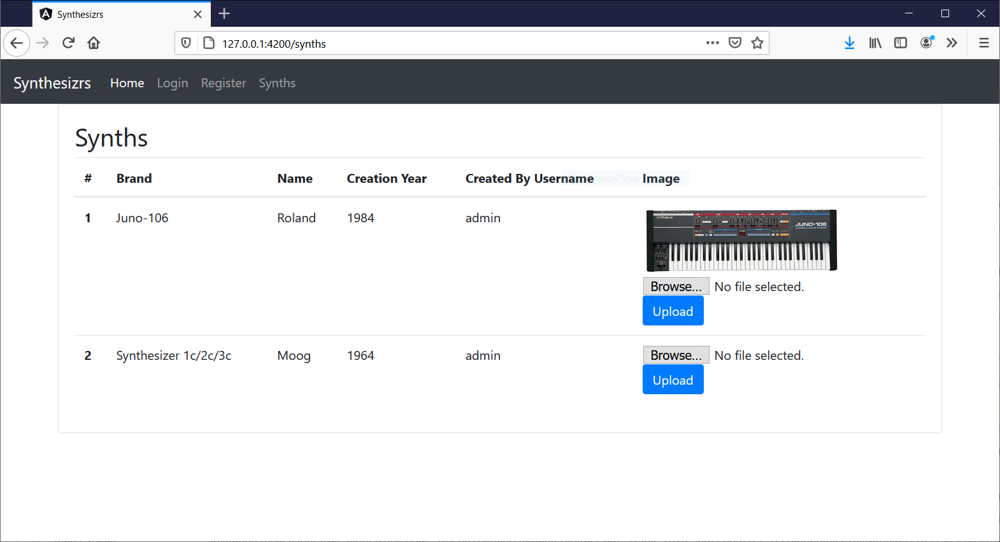
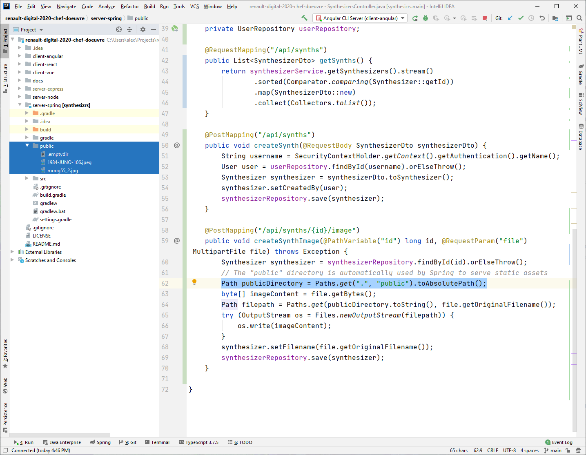

# Workshop 5 - Upload d'image (form et stockage disque)

Maintenant qu'on peut afficher du contenu aux utilisateurs grâce à [Workshop 4 : Création d'un page de contenu authentifiée](4-contenu), on peut créer des formulaires pour modifier des données, entre autre pour l'upload d'image.

La manière la plus simple de téléverser (upload) une image est de l'envoyer seule en POST dans un formulaire de type `Content-Type: multipart/form-data;`. C'est la manière la plus simple d'envoyer du contenu binaire (fichier),

Il faut donc que l'objet qui contient de l'image soit déjà créé, imaginons :

- Un POST crée l'objet suivant en BDD: `Synthesizer{id=1, brand=Roland, name=Juno-106, filename=null}`
    - Le filename est vide, il sera rempli dans une 2e requête
- Un POST téléverse l'image et l'associe à l'objet (attribut `filename`)



Côté serveur, l'image est stockée sur disque (pas en BDD), et la BDD a un lien vers l'image. L'objet en base est maintenant `Synthesizer{id=1, brand=Roland, name=Juno-106, filename=1984-JUNO-106.jpeg}`.

## Ajouter un endpoint pour l'upload d'image (Java / Spring Boot)

- Dans le "application.properties", ajouter :
    ```properties
    spring.servlet.multipart.max-file-size=10MB
    spring.servlet.multipart.max-request-size=10MB
    ```
- Dans votre entité qui contient l'image, ajouter une colonne pour le nom du fichier :
    ```java
        @Column
        private String filename;
    ```
- Dans votre controlleur, ajouter un endpoint POST qui va recevoir l'ID de l'entité et le contenu de l'image:
    ```java
        @PostMapping("/api/synths/{id}/image")
        public void createSynthImage(@PathVariable("id") long id, @RequestParam("file") MultipartFile file) throws Exception {
            Synthesizer synthesizer = synthesizerRepository.findById(id).orElseThrow();
            // The "public" directory is automatically used by Spring to serve static assets
            Path publicDirectory = Paths.get(".", "public").toAbsolutePath();
            byte[] imageContent = file.getBytes();
            Path filepath = Paths.get(publicDirectory.toString(), file.getOriginalFilename());
            try (OutputStream os = Files.newOutputStream(filepath)) {
                os.write(imageContent);
            }
            synthesizer.setFilename(file.getOriginalFilename());
            synthesizerRepository.save(synthesizer);
        }
    ```
- Quelques points :
    - Le type du fichier est `MultipartFile file`, géré par Spring, et contient l'image envoyé dans le formulaire
    - On écrit l'image sur disque dans le dossier "public" (au même niveau que l'application Spring), qui est servi automatiquement par Spring. Par example si on ajoute l'image "toto.jpg" dans ce dossier, Spring va servir l'image à l'URL "http://127.0.0.1:8080/toto.jpg"
    - On met à jour l'attribut `filename` de l'objet et on persiste en BDD



Image stockée sur disque

### Ajouter le formulaire (Angular)

- Dans "synth.component.html", on ajoute une colonne "image", avec un formulaire de type "file" qui permet l'upload de fichier :
    ```html
              <td>
                
                <form [formGroup]="uploadForm" (ngSubmit)="onSubmit($event)">
                  <div>
                    <input type="file" name="profile" (change)="onFileSelect($event)" data-id="{{ synth.id }}" />
                  </div>
                  <div>
                    <button type="submit" class="btn btn-primary">Upload</button>
                  </div>
                </form>
              </td>
    ```
- Dans "synth.component.ts", on ajoute les méthodes "onFileSelect" (le bouton "Browse) et "onSubmit" :
    ```javascript
    import {Component, OnInit} from '@angular/core';
    import {HttpClient, HttpHeaders} from "@angular/common/http";
    import {Router} from "@angular/router";
    import {FormBuilder, FormGroup} from '@angular/forms';
    
    @Component({
      selector: 'app-synths',
      templateUrl: './synths.component.html',
      styleUrls: ['./synths.component.css']
    })
    export class SynthsComponent implements OnInit {
    
      synths: any;
      uploadForm: FormGroup;
    
      constructor(private http: HttpClient,
                  private router: Router,
                  private formBuilder: FormBuilder) {
      }
    
      ngOnInit(): void {
        // Initialise le composant synth
        this.http
          .get("http://127.0.0.1:8080/api/synths", SynthsComponent.getAuthenticatedHttpOptions())
          .subscribe(
            synths => this.synths = synths,
            error => alert(`You need to be logged in to see this page: ${error}`)
          )
        // Initialise le composant form
        this.uploadForm = this.formBuilder.group({profile: ['']});
      }
    
      onFileSelect(event) {
        // Mettre le contenu de l'image dans le composant
        // "uploadForm" (pour afficher le nom du fichier
        if (event.target.files.length > 0) {
          const file = event.target.files[0];
          this.uploadForm.get('profile').setValue(file);
        }
      }
    
      onSubmit(event) {
        // Envoi du formulaire, on ajoute au formulaire le
        // contenu du fichier
        const synthId = event.target[0].attributes.id.value
        const formData = new FormData();
        formData.append('file', this.uploadForm.get('profile').value);
        this.http
          .post<any>(
            `http://127.0.0.1:8080/api/synths/${synthId}/image`,
            formData,
            SynthsComponent.getAuthenticatedHttpOptions())
          .subscribe(
            () => this.ngOnInit(),
            error => alert(`Error: ${error}`)
          );
      }
    
      private static getAuthenticatedHttpOptions(): any {
        const token = sessionStorage.getItem('token');
        if (token) {
          return {
            headers: new HttpHeaders({
              'Authorization': `Basic ${token}`,
            })
          };
        }
        return undefined;
      }
    
    }
    ```
- Quelques points :
    - On doit faire le POST avec l'ID de l'entité, donc on récupère la valeur sur `event.target[0].attributes.id.value` (il y a probablement une meilleure manière de faire)
    - La partie importante est : `formData.append('file', this.uploadForm.get('profile').value);`, qui sera envoyé dans le POST. Automatiquement le header suivant s'ajoute qui est important aussi : `Content-Type: multipart/form-data;`. Autrement dit, on n'envoi pas le contenu en JSON.
    - Pour rafraichir la page, il suffit d'appeler `this.ngOnInit()`

## Suite

Maintenant que nous avons une super application, nous allons la déployer, voir [Workshop 6 : Déployer son chef d'oeuvre](../06-deployment-frontend).

