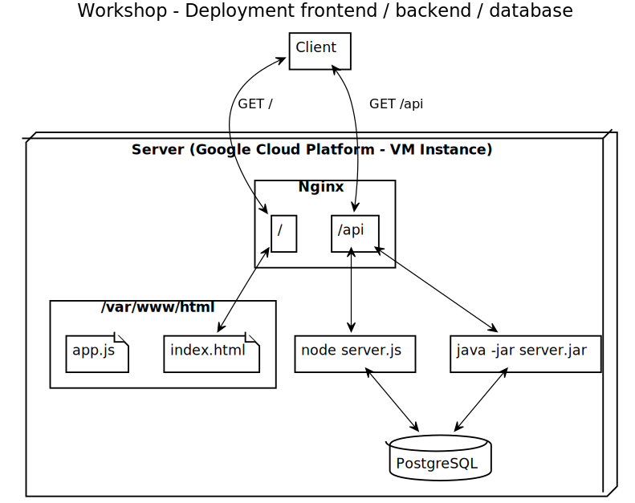

# Workshop 8 - Déployer son chef d'oeuvre (backend)

Maintenant que le frontend est déployé (voir [Workshop 6 - Déployer son chef d'oeuvre (frontend)](6-deployment-frontend)) et que le serveur a un domaine (voir [Workshop 7 - Ajouter son nom de domaine monchefdoeuvre.com](7-custom-domain)), nous pouvons déployer aussi le backend (BDD + application Java ou Node)

## Etape 02 - Deploiement base de donnée

### Contenu

- Installer PostgreSQL (ou autre) (https://www.digitalocean.com/community/tutorials/how-to-install-postgresql-on-ubuntu-20-04-quickstart)
    - `sudo apt install postgresql postgresql-contrib`
    - L'utilisateur "postgres" peut toujours se connecter à la base
        - Changer d'utilisateur : `sudo -u postgres psql` (pour revenir à votre user précédant, faire `exit`)
        - Se connecter à la BDD : `psql` (`exit` pour quitter le prompt)
        - Changer de mot de passe : `\password postgres` (entrer le mdp 2 fois)
        - L'utilisateur et MDP doit correspondre à votre config Sequelize ou Hibernate !
- Créer votre base de donnée
    - Se connecter à la BDD avec la procédure ci-haut
    - `CREATE DATABASE synthesizrs;` (changer le nom pour votre nom de BDD)
- Pour avoir le status de la BDD : `systemctl status postgresql`
- Pour voir les logs : `cat /var/log/postgresql/postgresql-12-main.log`

## Etape 03 - Déploiement backend

### Overview



### Contenu (Java / Spring Boot)

- {PC} Faire un packaging de votre application backend :
    - `./gradlew bootJar` (le jar : build/libs/synthesizrs-0.0.1-SNAPSHOT.jar)
- {PC} Le transférer sur votre instance :
    - `gcloud compute scp synthesizrs-0.0.1-SNAPSHOT.jar synthesizrs-instance:synthesizrs.jar`
- {VM} Installer Java (Open JDK 14) :
    - `sudo apt install openjdk-14-jdk`
    - Si vous voulez trouver une autre version de Java (pe 8, 11, etc.) : `apt-cache search openjdk-`
- {VM} Sur votre instance, vous pouvez lancer votre application :
    - `java -jar synthesizrs.jar`
    - Vous devriez voir Spring démarrer et créer les tables en BDD
    - Faites CTRL+C pour quitter, on va la démarrer en "service"
- {VM} Pour lancer votre application en mode "service" (changer les valeurs pour votre app) :
    - Créer le ficher "/etc/systemd/system/synthesizrs.service" :
        - sudo nano "/etc/systemd/system/synthesizrs.service" :
            ```
            [Unit]
            Description=Synthesizrs
            After=syslog.target
            After=network.target[Service]
            User=username
            Type=simple
            
            [Service]
            ExecStart=/usr/bin/java -jar /home/alex/synthesizrs.jar
            Restart=always
            StandardOutput=syslog
            StandardError=syslog
            SyslogIdentifier=helloworld
            
            [Install]
            WantedBy=multi-user.target
            ```
    - Démarrer le service : `sudo systemctl start synthesizrs`
    - Status (et log) du service : `sudo systemctl status synthesizrs`
    - Vous pouvez le requêter : `curl 127.0.0.1:8080`

Maintenant il faut configurer nginx :    

- {VM} On supprime l'ancienne conf :
    - `rm /etc/nginx/sites-enabled/default`
- {VM} Créer le fichier "/etc/nginx/sites-available/synthesizrs.conf" :
    - `sudo nano /etc/nginx/sites-available/synthesizrs.conf`
        ```
        server {
                listen 80;
                listen [::]:80;
        
                root /home/alex/client;
        
                location / {
                        try_files $uri $uri/ /index.html;
                }
        
                location /api {
                     proxy_pass http://localhost:8080;
                     proxy_set_header X-Forwarded-For $proxy_add_x_forwarded_for;
                     proxy_set_header X-Forwarded-Proto $scheme;
                     proxy_set_header X-Forwarded-Port $server_port;
                }
        
                location /public {
                     proxy_pass http://localhost:8080;
                     proxy_set_header X-Forwarded-For $proxy_add_x_forwarded_for;
                     proxy_set_header X-Forwarded-Proto $scheme;
                     proxy_set_header X-Forwarded-Port $server_port;
                }
        }
        ```
- {VM} Activer le fichier : `sudo ln -s /etc/nginx/sites-enabled/default /etc/nginx/sites-available/synthesizrs.conf`
- {VM} Restart nginx : `sudo systemctl restart nginx`

## Annexes

Mode "développement", les données ne sont pas importantes on peut les perdre :

- Ajouter la configuration pour drop / create la BDD a change démarrage
    ```properties
    spring.jpa.properties.hibernate.hbm2ddl.auto=create-drop
    spring.jpa.generate-ddl=true
    ```
- Ajouter un ficher data.sql pour charger des données initiales (voir https://www.baeldung.com/spring-boot-data-sql-and-schema-sql)
    ```sql
    INSERT INTO user VALUES ('admin', 'password');
    ```

Mode "production", on doit garder les données :

- Garder la même BDD entre les redémarrage
    ```properties
    spring.jpa.properties.hibernate.hbm2ddl.auto=none
    ```
- Il faudrait une politique de "backup" de la BDD au cas ou
- Utiliser du SQL pour modifier le schéma : 
    ```sql
    ALTER TABLE user ADD COLUMN age;
    ```

