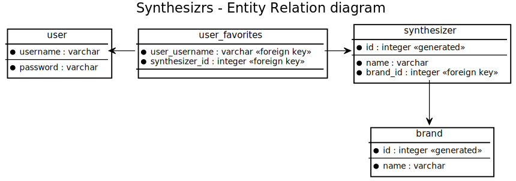

# Workshop 09 - Design BDD 01 - Faire son diagramme

Le but de ce workshop c'est de faire le design de sa base de donnée pour son chef d'oeuvre :

- Définir les différentes entités, par exemple : "User", "Role", etc.
    - Définir les propriétés : user.firstName, user.lastName, etc.
    - Définir les types des entités : user.firstName (String), etc.
- Définir les relations entre les entités, par exemple : un User a 1 Role, et Role est associé à plusieurs users
- Faire le diagramme correspondant
- Écrire le SQL correspondant
- Écrire le Java (Hibernate) / JavaScript (Sequelize) correspondant

Nous avons déjà partiellement couvert ce sujet : [Simplon.co - Formation UML "Entity Relationship Diagram"](https://www.youtube.com/watch?v=WRlmzRIHX4s&list=PLWPX7CYPrFFrPswEo5SdpG9jOxib8ug_a&index=16)

## Exemple pour l'application "Synthesirs"

### Les entitées

- User
    - username : String
    - password : String
    - favoris : List<Synthesizer>
- Synthesizer
    - id : Integer (auto gen)
    - name : String
    - brand : Brand
    - filename : String
- Brand
    - id : Integer (auto gen)
    - name : String

### Les relations

- Un utilisateur peut ajouter en "favoris" plusieurs (n) synths
- Un synthesizer doit avoir (1) marque

### Le diagramme



### Le SQL

```sql
CREATE TABLE users (
    username varchar(100) primary key,
    password varchar(100)
);
-- ...
```

### Le Java (Hibernate)

```java
@Entity("users")
public class User {

    @Id
    private String username;
    
    @Column
    private String password

}
```

### Le JavaScript (Sequelize)

```javascript
module.exports = (sequelize, Sequelize) => {
    return sequelize.define("user", {
        username: {
            type: Sequelize.STRING
        },
        password: {
            type: Sequelize.STRING
        },
    });
};
```
