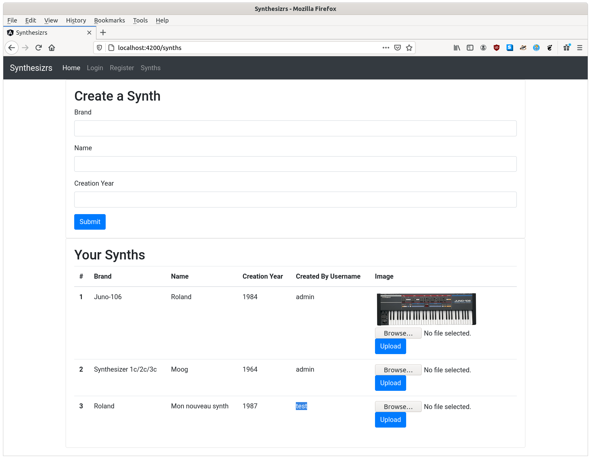
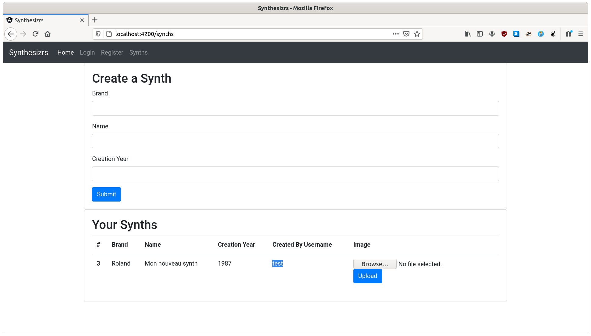

# Workshop 10 - Design BDD - Filtrer par utilisateur

Le but de ce workshop est d'associer chaque objet créé à un utilisateur, ce qui permet ensuite d'afficher à l'utilisateur que les objets qu'il a créé. Rappel du workshop précédent, [Workshop 9 - Design de sa base de donnée](../09-design-bdd-01-diagramme).

Tous les synthériseurs sont créés par un utilisateur, on peut systématiquement ajouter la relation suivante :


Cette relation est une relation "many-to-one", soit "plusieurs synthétiseurs on été créé par un utilisateur" et "un utilisateur a créé zéro ou plusieurs synthétiseurs".

## Design frontend

Dans cette page d'accueil, un utilisateur peut voir tous les synthétiseurs de tout le monde. On cherche à ce qu'il puisse voir seulement ceux qu'il a créé:



## Design backend

Puisque cette page est authentifiée, le backend reçoit systématiquement l'utilisateur qui fait la requête (POST ou GET).

- Spring :
    ```java
    String username = SecurityContextHolder.getContext().getAuthentication().getName();
    User user = userRepository.findById(username).orElseThrow();
    ```
- Express (si JWT) :
    ```javascript
    const jwt = require('jsonwebtoken')
    const User = require('../models/User')
    
    const auth = async(req, res, next) => {
        const token = req.header('Authorization').replace('Bearer ', '')
        const data = jwt.verify(token, process.env.JWT_KEY)
        try {
            const user = await User.findOne({ _id: data._id, 'tokens.token': token })
            // ...
        } catch (error) {
            // ...
        }  
    }
    module.exports = auth
    ```

Puis, lorsque l'utilisateur fait un GET, il faut filtrer les éléments pour cet utilisateur, pour que l'utilisateur ne voit que ses synths:



## Affichage basé sur les roles

Les utilisateurs ont des "role", il est possible d'afficher du contenu en fonction du rôle de l'utilisateur:

- Le rôle "USER" ne peut voir que son propre contenu
- Le rôle "ADMIN" peut voir le contenu de tous les utilisateurs
- etc

## Design BDD

Workshop suivant : [Workshop 11 - Design BDD 03 - Ajouter une relation](../11-design-bdd-03-ajouter-relation)
