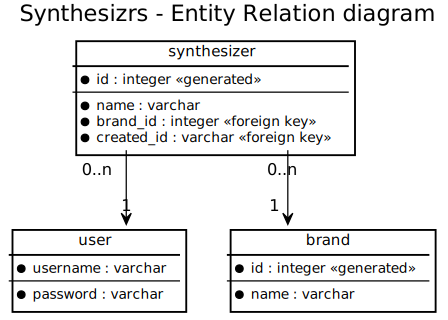

# Workshop 10 - Design frontend - Many-to-one

Le but de ce workshop c'est de faire le design du frontend pour une relation many-to-one. Rappel du workshop précédent, [Workshop 9 - Design de sa base de donnée](9-design-base-de-donnee) :
 
- Plusieurs synthetiseurs font partis d'une même marque (ManyToOne)
- Une marque a plusieurs synthétiseurs (OneToMany)

Les cardinalités sont importantes, elle définissent si la relation est optionnelle :

- Côté "many" :
    - **"0..n"** : La relation est optionnelle (exemple : une marque peut exister mais n'avoir aucun modèle)
    - **"1..n"** : La relation est obligatoire (exemple : une commande doit avoir au moins 1 item)
- Côté "one" :
    - **"0"** : La relation est optionnelle (exemple : un utilisateur peut avoir une adresse)
    - **"1"** : La relation est obligatoire (exemple : un synthé doit avoir une marque)

## Page front 1 : Création de la marque

La marque doit être créée avant (le synthétiseur a un lien vers la marque).

TODO

## Page front 2 : Création du synthé

Le synthé référence la marque, il doit avoir une liste de sélection de la marque.

TODO

## Bonus

Tous les éléments sont créés par un utilisateur, on peut systématiquement le lier :

