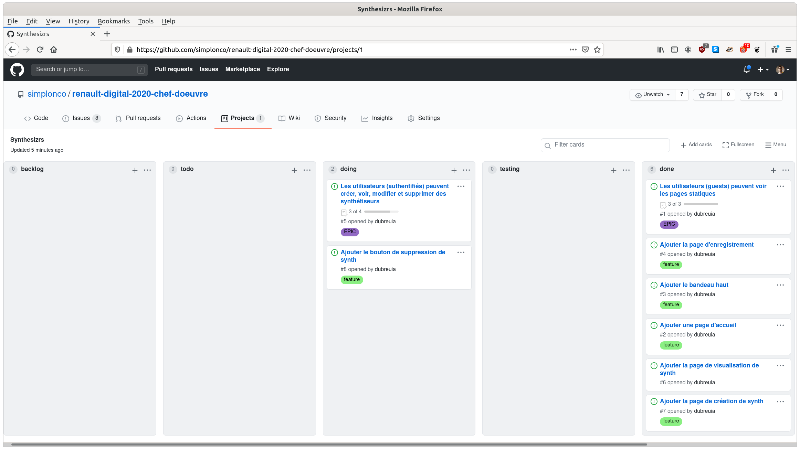

# Workshop 11 - Gestion de projet

Avant de se lancer dans la gestion de projet, vous avez besoin de 2 choses:

- La liste des fonctionnalités de votre application (ex : "Les utilisateurs (authentifiés) peuvent créer, voir, modifier et supprimer des synthétiseurs")
- La liste des entités de votre application (ex : "[Workshop 09 - Design BDD 01 - Faire son diagramme](../09-design-bdd-01-diagramme)")

Dans la méthodologie Agile, les diagrammes ne sont pas des spécifications, ce sont des documents servant à la **discussion**. Donc votre diagramme de cas d'utilisation et entités relation sont utiles pour nous communiquer votre intention, et seront à modifier tout au long de votre chef d'oeuvre pour expliquer (communiquer) vos choix.

## Création des tâches

- Création d'un projet dans GitHub (exemple : https://github.com/simplonco/renault-digital-2020-chef-doeuvre/projects/1)
    - Activer les projets dans "Settings > Options > Project"
    - Créer un nouveau projet dans l'onglet "Projects"
    - Créer des colonnes ("backlog", "todo", "doing", "testing", "done")
    - Créer des issues (mettre aussi ce que vous avez déjà fait !)

## Découpage d'une tâche

Les tâches peuvent avoir 2 natures :

- **EPIC** : Correspond à un "cas d'utilisation" (voir coaching : [Simplon.co - Formation UML "Use Case Diagram"](https://www.youtube.com/watch?v=PifJhRUzRLs)) :
    - Les epic contiennent une liste de tâches "FEATURE" qui seront à implémenter 
    - Exemple : "[Les utilisateurs (guests) peuvent voir les pages statiques #1](https://github.com/simplonco/renault-digital-2020-chef-doeuvre/issues/1)"
    - Exemple : "[Les utilisateurs (authentifiés) peuvent créer, voir, modifier et supprimer des synthétiseurs #5](https://github.com/simplonco/renault-digital-2020-chef-doeuvre/issues/5)"
- **FEATURE** : Correspond à une tâche technique d'implémentation, c'est le découpage le plus petit que vous puissiez faire :
    - Une feature commence par un verbe, et a un contenu précis et décrit en mots et diagrammes
    - Exemple : [Ajouter la page d'enregistrement #4](https://github.com/simplonco/renault-digital-2020-chef-doeuvre/issues/4)
