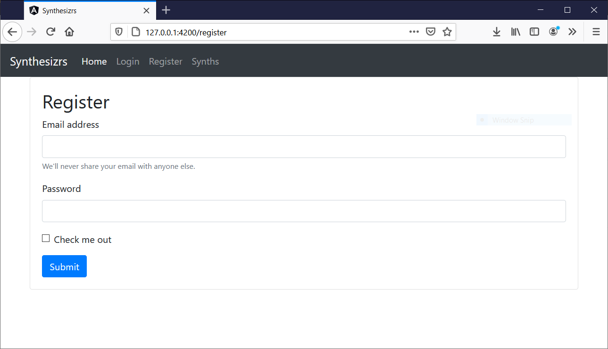

# Workshop 2 - Création d'une page d'enregistrement (ajout backend)

Maintenant que nous avons notre première page suite à [Workshop 1 : Création d'une landing page pour chef d'oeuvre](1-landing-page), nous pouvons ajouter une page d'enregistrement d'utilisateur!



C'est un bon prétexte pour ajouter un backend + base de donnée.

## Créer une base de donnée

- Installer Postgresql : https://www.postgresql.org/download/
- Lors de l'installation, choisir un mot de passe pour l'utilisateur postgres
- Créer la base de donnée pour votre application (ex. "synthesizrs")
    - Dans un terminal : `psql -U postgres -W postgres` (si ça ne fonctionne pas, `sudo -u postgres psql postgres`)
    - Une fois dans postgres : `CREATE DATABASE synthesizrs;`

## Créer un backend (Java / Spring Boot)

- Aller sur https://start.spring.io/ et remplir <a href="./workshop-backend-spring-bootstrap.png">les dépendances suivantes</a>
- Télécharger le zip, et extraire dans votre projet sous "server-spring"
- Dans "server-spring/src/main/resources/application.properties", ajouter (changer les valeurs pour votre projet) :
    ```properties
    spring.datasource.name=database
    spring.datasource.url=jdbc:postgresql://localhost:5432/synthesizrs
    spring.datasource.username=postgres
    spring.datasource.password=password
    spring.jpa.properties.hibernate.dialect=org.hibernate.dialect.PostgreSQL95Dialect
    spring.jpa.properties.hibernate.hbm2ddl.auto=create-drop
    spring.jpa.generate-ddl=true
    logging.level.org.hibernate.SQL=DEBUG
    logging.level.org.hibernate.type.descriptor.sql.BasicBinder=TRACE
    ```
- Aller dans le répertoire "server-spring", puis installer l'app:
    ```bash
    ./gradlew build
    ```
- Les tests devraient passer, ce qui veut dire que votre backend communique avec la BDD

## Créer un backend (Node.js / Express)

- Créer une nouvelle application Express avec
    ```bash
    npx express-generator server-node
    ```
- Aller dans le répertoire "cd server-node", puis installer l'app: 
    ```bash
    npm install
    ```
- Installer les dépendances pour PostgreSQL
    ```bash
    npm install sequelize pg pg-hstore body-parser cors --save
    ```
- Ajouter un fichier "config/db.config.js":
    ```javascript
    module.exports = {
        HOST: "localhost",
        USER: "postgres",
        PASSWORD: "password",
        DB: "synthesizrs",
        dialect: "postgres"
    };
    ```
- Ajouter un fichier "models/index.js":
    ```javascript
    const dbConfig = require("../config/db.config.js");
    
    const Sequelize = require("sequelize");
    const sequelize = new Sequelize(dbConfig.DB, dbConfig.USER, dbConfig.PASSWORD, {
        host: dbConfig.HOST,
        dialect: dbConfig.dialect,
        operatorsAliases: false,
    });
    
    const db = {};
    
    db.Sequelize = Sequelize;
    db.sequelize = sequelize;
    
    db.models = require("./model.js")(sequelize, Sequelize);
    
    module.exports = db;
    ```
- Dans "app.js", à la fin du fichier, avant le "module.export", ajouter:
    ```javascript
    // database
    const db = require("./models");
    db.sequelize.sync({ force: true }).then(() => {
      console.log("Drop and re-sync db.");
    });
    ```
- Lancer l'application pour vérifier que l'app se connecte bien à la BDD:
    ```bash
    npm install
    
    # ...
    # Executing (default): SELECT 1+1 AS result
    # Drop and re-sync db.
    ```

## Ajouter un endpoint `/register` (Java / Spring Boot)

- Dans le package `config`, créer une classe pour initialiser la sécurité:
    ```java
    @Configuration
    @EnableWebSecurity
    public class BasicAuthConfiguration extends WebSecurityConfigurerAdapter {
    
        @Override
        protected void configure(AuthenticationManagerBuilder auth) throws Exception {
            auth.inMemoryAuthentication().passwordEncoder(passwordEncoder());
        }
    
        @Override
        protected void configure(HttpSecurity security) throws Exception {
            security
                    // disable form login security (for login)
                    .csrf().disable()
                    // requests URL
                    .authorizeRequests()
                    .antMatchers("/api/**").authenticated()
                    // authentication type
                    .and().httpBasic();
        }
    
        @Bean
        public PasswordEncoder passwordEncoder() {
            return NoOpPasswordEncoder.getInstance();
        }
    
        @Override
        @Bean(name = BeanIds.AUTHENTICATION_MANAGER)
        public AuthenticationManager authenticationManagerBean() throws Exception {
            return super.authenticationManagerBean();
        }
    
    }
    ```
- Dans le package `controllers`, créer une classe pour votre point d'entré (endpoint) pour le front
    ```java
    @CrossOrigin
    @RestController
    public class UserController {
    
        @Autowired
        private UserService userService;
    
        @PostMapping("/register")
        public void register(@RequestBody UserDto user) {
            userService.registerUser(new User(user.getUsername(), user.getPassword()));
        }
    
    }
    ```
- Dans le package `model`, créer une classe `User`, et sa classe associée `UserDto` and le package `dtos`:
    ```java
    @Entity(name = "users")
    public class User {
    
        @Id
        private String username;
    
        @Column
        private String password;
    
    }
    ```
- Dans le package `repositories`, créer `UserRepository`
- Dans le package `services`, créer `UserService` et `UserServiceImpl`
- Relancer votre application, puis avec Postman, tester l'API "127.0.0.1:8080/register" avec le JSON suivant, puis vérifier que vous avez le contenu en BDD.
    ```json
    {
        "username": "moi",
        "password": "password"
    }
    ```

## Ajouter un endpoint `/register` (Node.js / Express)

- Ajouter un ficher "models/model.js"
    ```javascript
    module.exports = (sequelize, Sequelize) => {
        return sequelize.define("user", {
            username: {
                type: Sequelize.STRING
            },
            password: {
                type: Sequelize.STRING
            },
        });
    };
    ```
- Dans "model/index.js", ajouter la ligne suivante avant le "module.export":
    ```javascript
    db.models = require("./model.js")(sequelize, Sequelize);
    ```
- TODO ajouter une route "/register"

## Ajouter un formulaire dans le frontend (Angular)

- Ajouter un formulaire "Register" dans le frontend
- Appeler votre route: https://127.0.0.1:8080 ou https://127.0.0.1:3000 avec (les valeurs du formulaire):
    ```json
    {"username":"test","password":"test"}
    ```
- Vérifier que les valeurs sont bien persistées en base de données
- Le front peut faire un forward sur la page "login" lorsque le register est ok

## Suite

Rendez-vous à l'atelier suivant, [Workshop 3 : Création d'une page de login (ajout authentification)](../3-login), pour ajouter une page de login.
