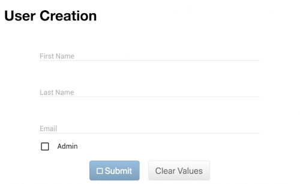

# Workshop 2 : Création d'une page d'enregistrement (ajout backend)

Maintenant que nous avons notre première page suite à [Workshop 1 : Création d'une landing page pour chef d'oeuvre](1-landing-page), nous pouvons ajouter une page d'enregistrement d'utilisateur!

C'est un bon prétexte pour ajouter un backend + base de donnée.

## Créer une base de donnée

- Installer Postgresql : https://www.postgresql.org/download/
- Lors de l'installation, choisir un mot de passe pour l'utilisateur postgres
- Créer la base de donnée pour votre application (ex. "synthesizrs")
    - Dans un terminal : `psql -U postgres -W postgres` (si ça ne fonctionne pas, `sudo -u postgres psql postgres`)
    - Une fois dans postgres : `CREATE DATABASE synthesizrs;`

## Créer un backend

<table>
<th>Spring Boot</th>
<th>Node.js</th>
<tr>
<td>
<ul>
<li>Aller sur https://start.spring.io/ et remplir les dépendances suivantes:</li>
<li></li>
<li>Télécharger le zip, et extraire dans votre projet sous "server-spring"</li>
<li>Dans "server-spring/src/main/resources/application.properties", ajouter (changer les valeurs pour votre projet) :</li>
<pre lang="properties">
spring.datasource.name=database
spring.datasource.url=jdbc:postgresql://localhost:5432/synthesizrs
spring.datasource.username=postgres
spring.datasource.password=password
spring.jpa.properties.hibernate.dialect=org.hibernate.dialect.PostgreSQL95Dialect
spring.jpa.properties.hibernate.hbm2ddl.auto=create-drop
spring.jpa.generate-ddl=true
logging.level.org.hibernate.SQL=DEBUG
logging.level.org.hibernate.type.descriptor.sql.BasicBinder=TRACE
</pre>
<li>Ouvrir un terminal dans "server-spring" : `.gradlew build`</li>
<li>Un test va échouer, vous pouvez ignorer (test de base de donnée)</li>
</ul>
</td>
<td>
<ul>
<li>Aller sur https://start.spring.io/ et remplir les dépendances suivantes:</li>
<li></li>
<li>Télécharger le zip, et extraire dans votre projet sous "server-spring"</li>
<li>Dans "server-spring/src/main/resources/application.properties", ajouter (changer les valeurs pour votre projet) :</li>
<pre lang="properties">
spring.datasource.name=database
spring.datasource.url=jdbc:postgresql://localhost:5432/synthesizrs
spring.datasource.username=postgres
spring.datasource.password=password
spring.jpa.properties.hibernate.dialect=org.hibernate.dialect.PostgreSQL95Dialect
spring.jpa.properties.hibernate.hbm2ddl.auto=create-drop
spring.jpa.generate-ddl=true
logging.level.org.hibernate.SQL=DEBUG
logging.level.org.hibernate.type.descriptor.sql.BasicBinder=TRACE
</pre>
<li>Ouvrir un terminal dans "server-spring" : `.gradlew build`</li>
<li>Un test va échouer, vous pouvez ignorer (test de base de donnée)</li>
</ul>
</td>
</tr>
</table>

## Ajouter un endpoint /register

TODO

### Node.js

TODO
