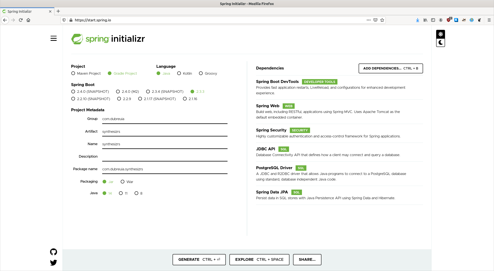

# Workshop 3 : Ajouter du contenu dynamique (backend)

## Créer un backend

### Spring Boot

- Aller sur https://start.spring.io/ et remplir les dépendances suivantes:

- Télécharger le zip, et extraire dans votre projet sous "server-spring"
- Dans "server-spring/src/main/resources/application.properties", ajouter (changer les valeurs pour votre projet) :
    ```properties
    spring.datasource.name=database
    spring.datasource.url=jdbc:postgresql://localhost:5432/synthesizrs
    spring.datasource.username=postgres
    spring.datasource.password=password
    spring.jpa.properties.hibernate.dialect=org.hibernate.dialect.PostgreSQL95Dialect
    spring.jpa.properties.hibernate.hbm2ddl.auto=create-drop
    spring.jpa.generate-ddl=true
    logging.level.org.hibernate.SQL=DEBUG
    logging.level.org.hibernate.type.descriptor.sql.BasicBinder=TRACE
    ```
- Ouvrir un terminal dans "server-spring" : `.gradlew build`
- Un test va échouer, vous pouvez ignorer (test de base de donnée)

### Node.js

TODO

## Ajouter un endpoint pour le front


