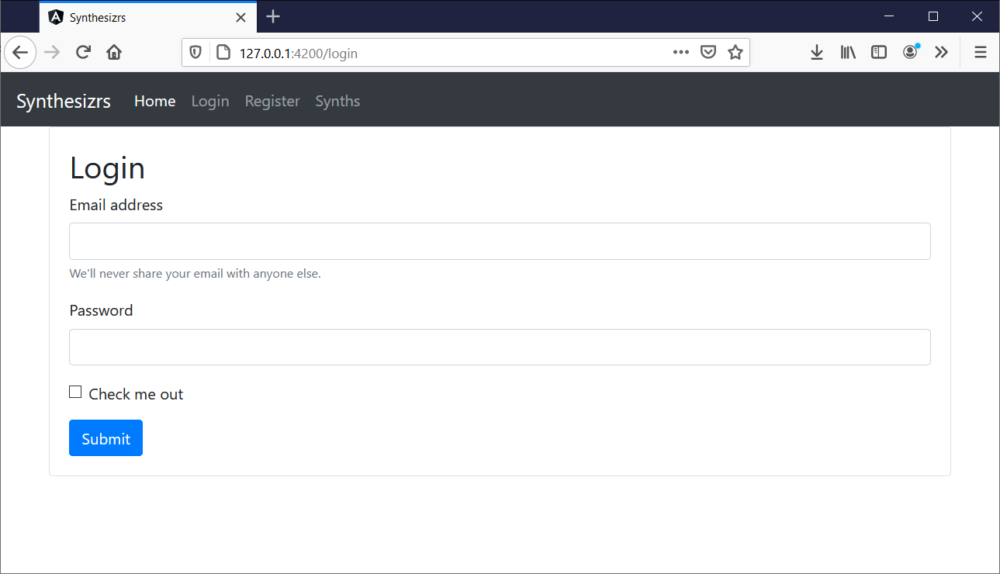
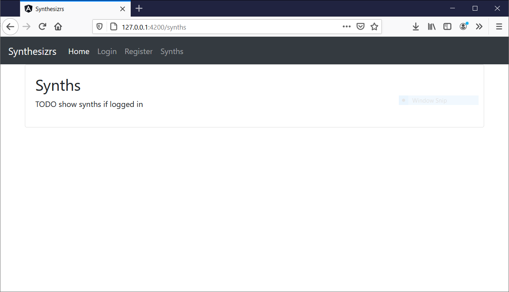

# Workshop 3 - Création d'une page de login (ajout authentification)

Maintenant qu'on a une page register avec [Workshop 2 : Création d'une page d'enregistrement (ajout backend)](2-backend), on peut maintenant logger nos utilisateurs !



## Ajout du login (Java / Spring Boot)

On cherche à valider les utilisateurs lorsqu'ils appellent la méthode "/login", et valider les utilisateurs pour tous les URL commençant par "/api/**". Les mots de passe en BDD peuvent être chiffrés (BCrypt). On ajoute aussi les roles associés aux utilisateurs.

- Dans `BasicAuthConfiguration`, ajouter le contenu suivant.
    ```java
    @Configuration
    @EnableWebSecurity
    public class BasicAuthConfiguration extends WebSecurityConfigurerAdapter {
    
        @Autowired
        private UserDetailsService userDetailsService;
    
        @Override
        protected void configure(AuthenticationManagerBuilder auth) {
            auth.authenticationProvider(authenticationProvider());
        }
    
        @Override
        protected void configure(HttpSecurity security) throws Exception {
            security
                    // disable form login security (for login)
                    .csrf().disable()
                    // requests URL
                    .authorizeRequests()
                    .antMatchers("/api/**").authenticated()
                    // authentication type
                    .and().httpBasic()
                    // cors
                    .and().cors();
        }
    
        @Bean
        public AuthenticationProvider authenticationProvider() {
            DaoAuthenticationProvider provider = new DaoAuthenticationProvider();
            provider.setPasswordEncoder(passwordEncoder());
            provider.setUserDetailsService(userDetailsService);
            return provider;
        }
    
        @Bean
        public PasswordEncoder passwordEncoder() {
            return new BCryptPasswordEncoder();
        }
    
    }
    ```
- Quelques points à noter:
    - Dans `configure`, la partie `cors` est importante (en plus de CORS sur les controlleurs)
    - Dans `authenticationProvider`, c'est la classe qui ira chercher l'utilisateur en bdd (il va falloir créer le `UserDetailsService`)
    - Dans `passwordEncoder`, c'est le hashing du password, pe "test" -> "$2a$10$6MhOkqyfBeRf/tWx6bn/Ou6cVTdP2ZKMA.CmTdBnNyxCExbC3gAjy"
- Dans `UserController`, ajouter login:
    ```java
        @GetMapping("/login")
        public void login(@RequestBody UserDto user) {
            userService.verifyUser(user.getUsername(), user.getPassword());
        }
    ```
- Créer `Role`, pour les utilisateurs:
    ```java
    @Entity(name = "roles")
    public class Role {
    
        @Id
        private String name;
    
        @ManyToMany(mappedBy = "roles")
        private List<User> users;
    
        // ...
    
    }
    ```
- Dans `User`, ajouter les roles:
    ```java
    @Entity(name = "users")
    public class User {
    
        @Id
        private String username;
    
        @Column
        private String password;
    
        @Column
        private boolean enabled;
    
        @ManyToMany
        @JoinTable(
                name = "user_roles",
                joinColumns = @JoinColumn(name = "user_username"),
                inverseJoinColumns = @JoinColumn(name = "role_name"))
        private List<Role> roles;
    
        // ...
    
    }
    ```
- Créer le `UserDetailService`, qui va charger en BDD l'utilisateur lors du login (utilisé dans la config de sécurité):
    ```java
    @Service
    public class UserDetailsServiceImpl implements UserDetailsService {
    
        @Autowired
        private UserRepository userRepository;
    
        @Override
        @Transactional
        public UserDetails loadUserByUsername(String username) throws UsernameNotFoundException {
            User user = userRepository.findById(username)
                    .orElseThrow(() -> new UsernameNotFoundException("user not found " + username));
            List<Role> roles = user.getRoles();
            Set<GrantedAuthority> authorities = roles.stream()
                    .map(role -> new SimpleGrantedAuthority(role.getName()))
                    .collect(toSet());
            return new org.springframework.security.core.userdetails.User(
                    user.getUsername(), user.getPassword(), authorities);
        }
    
    }
    ```
- Dans le `UserService`, ajouter une méthode de validation du mot de passe pour l'utilisateur chargé par le `UserDetailService`:
    ```java
        @Override
        public void verifyUser(String username, String password) {
            UserDetails user = userDetailsService.loadUserByUsername(username);
            if (!passwordEncoder.matches(password, user.getPassword())) {
                throw new BadCredentialsException("bad credentials " + username);
            }
        }
    ```

### Node.js

TODO

## Ajout d'une page frontend (Angular)

- Ajouter un nouveau composant Angular, "login.component.ts":
    ```javascript
    import {Component, OnInit} from '@angular/core';
    import {Router} from "@angular/router";
    import {HttpClient} from "@angular/common/http";
    
    @Component({
      selector: 'app-login',
      templateUrl: './login.component.html',
      styleUrls: ['./login.component.css']
    })
    export class LoginComponent implements OnInit {
    
      model: any;
    
      constructor(private http: HttpClient,
                  private router: Router) {
      }
    
      ngOnInit() {
        this.model = {};
        sessionStorage.setItem('token', '');
      }
    
      login() {
        this.http
          .post("http://127.0.0.1:8080/login", {
            "username": this.model.username,
            "password": this.model.password,
          })
          .subscribe(() => {
              let base64hash = btoa(this.model.username + ':' + this.model.password);
              sessionStorage.setItem('token', base64hash);
              this.router.navigate(["/synths"])
            },
            error => {
              alert(`Login failed: ${error}`)
            })
      }
    
    }
    ```
- Quelques points:
    - On appelle la méthode "login" du backend avec les éléments du formulaire
    - Si le login est en succès, on stoke le token en session storage (stockage client dans le navaigateur), pour pouvoir le renvoyer plus tard. On redirige vers la page racine authentifiée
    - Sinon on affiche une erreur

Si l'authentification est réussie, on redirige vers la page racine des utilisateurs authentifés:



## Suite

Rendez-vous à l'atelier suivant, [Workshop 4 : Création d'un page de contenu authentifiée](../4-contenu), pour ajouter du contenu à cette page.
