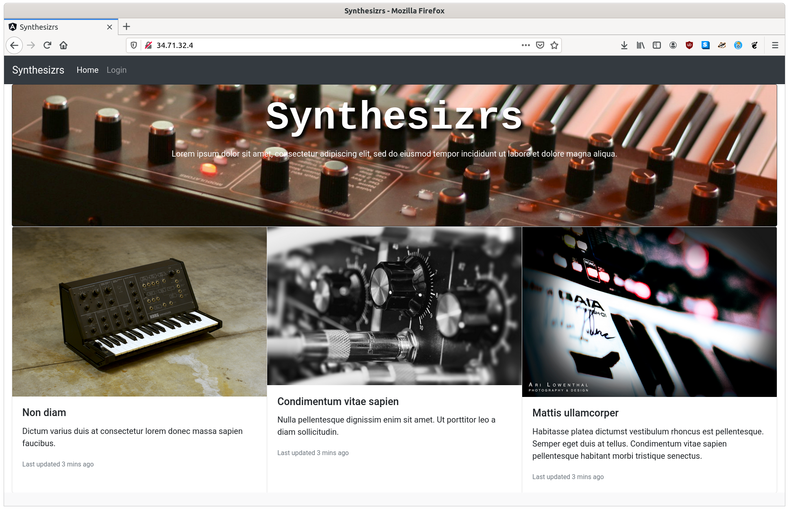

# Workshop 6 - Déployer son chef d'oeuvre (frontend)

Le but de ce workshop est de déployer la landing page produite pendant le dernier atelier sur Google Cloud Platform (GCP).

## Etape 01 - Déploiement frontend seulement

### Overview


### Créer son compte

- Aller sur https://console.cloud.google.com/getting-started
- Créer son compte, vous deviez obtenir 300$ gratuit si c'est votre 1e compte (pas nécessaire)

### Créer un nouveau projet GCP

- Aller sur la création de projet https://console.cloud.google.com/projectselector2/home/dashboard
- Cliquer sur "Créer un projet", nommer le (ex. "Synthesizrs")
- Télécharger le "SDK Cloud", suivre les instructions par plateforme (https://cloud.google.com/sdk/docs/quickstarts)
- Ensuite `gcloud init`, suivre les instruction
- Choisir son projet, si vous avez beaucoup de projets, il faudra entrer l'id (ex. synthesizrs)

### Créer une nouvelle instance VM gratuite

GCP : https://cloud.google.com/free/ (1 instance f1-micro + 30 Go disk)

Référence : https://medium.com/@hbmy289/how-to-set-up-a-free-micro-vps-on-google-cloud-platform-bddee893ac09 

- Aller dans "Compute Engine" puis "Instance de VM", cliquer sur "Créer une instance"
    - Noter le nom (ex. "synthesizrs-instance")
    - Région il faut prendre une région aux US (gratuit) 
    - Dans "Type de Machine", choisir "f1-micro" (gratuit)
    - Vérifier qu'à droite vous avez "Les 744 premières heures d'utilisation de l'instance f1-micro sont gratuites ce mois-ci."
    - Dans "Disque de démarage" faire "Modifier" puis prendre "Ubuntu" et "Ubuntu 20.04 LTS"
    - Changer la taille du disque pour 30 Go (gratuit)
    - Dans "Pare-feu" cocher "Autoriser le traffic HTTP"
- Attention vous n'avez pas droit a 2 instances gratuites.


### Upload de son frontend sur GCP

- Faire un packaging de production de votre application
    - Pour Angular : `ng build --prod --output-path client` (https://angular.io/guide/deployment#basic-deployment-to-a-remote-server)
    - Pour React : `npm run build; mv build client` (https://create-react-app.dev/docs/deployment/)
    - Pour Vue.js : `npm run build; mv build client` (https://cli.vuejs.org/guide/deployment.html#netlify)
- Faire un tar du dossier contenant votre app : `tar cf client.tar client`
- Transférer le tar sur votre VM
    - Lorsque le gcloud se connecte pour la première fois en SSH, il va créer une clef SSH, et vous demander un mot de passe pour cette clef (https://cloud.google.com/compute/docs/instances/transfer-files)
    - `gcloud compute scp client.tar synthesizrs-instance:app.tar`
- Se connecter à son instance : `gcloud compute ssh --zone "us-central1-a" "synthesizrs-instance" --project "synthesizrs"` (https://cloud.google.com/compute/docs/instances/connecting-to-instance)
    - Installer nginx sur l'instance : `sudo apt install nginx`
    - Extraire son app : `tar xf app.tar`
    - Copier son app dans le dossier racine de nginx : `sudo cp -R client/* /var/www/html`
- Aller dans "Compute Engine" puis "Instance de VM", cliquer sur "Adresse IP externe"



### Configurer nginx

Vous avez peut-être remarqué, en ajoutant un chemin à votre URL (pe http://34.71.32.4/page), vous avez une 404, il faut dire à Nginx que tous les chemins sont servis par votre application Angular / React / Vue :

- {VM} On supprime l'ancienne conf :
    - `sudo rm /etc/nginx/sites-enabled/default`
- {VM} Créer le fichier "/etc/nginx/sites-available/synthesizrs.conf" :
    - `sudo nano /etc/nginx/sites-available/synthesizrs.conf`
        ```
        server {
                listen 80;
                listen [::]:80;
                root /var/www/html;
                location / {
                        try_files $uri $uri/ /index.html;
                }
        }
        ```
- {VM} Activer le fichier : `sudo ln -s /etc/nginx/sites-available/synthesizrs.conf /etc/nginx/sites-enabled/default`
- {VM} Reload nginx : `sudo systemctl Reload nginx`
- Maintenant les URL avec chemin sont aussi pris en compte par votre application front
