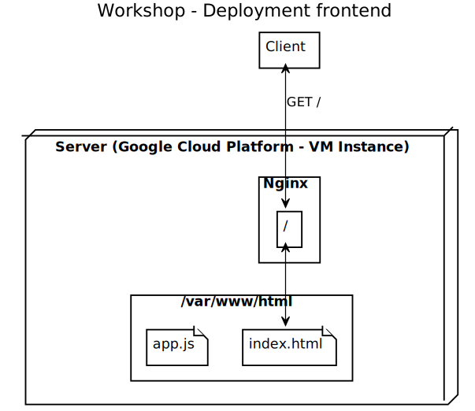
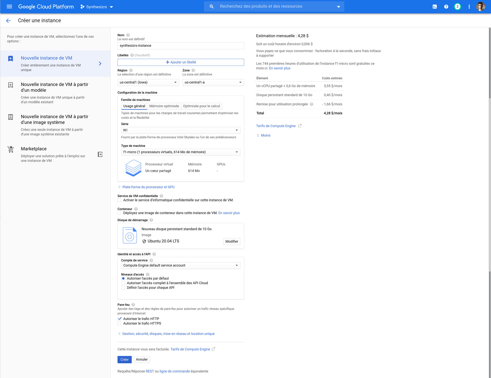
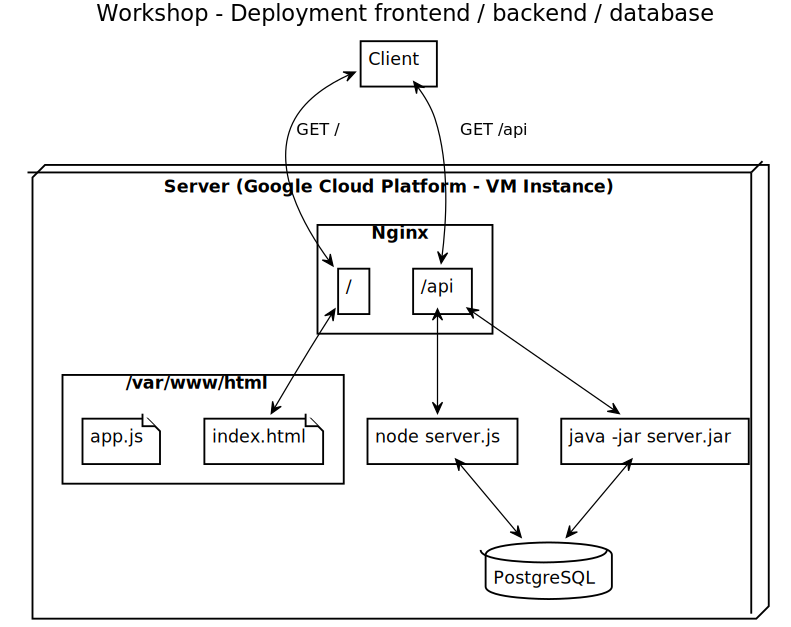

# Workshop 6 : Déployer son chef d'oeuvre

Le but de ce workshop est de déployer la landing page produite pendant le dernier atelier sur Google Cloud Platform (GCP).

## Etape 01 - Déploiement frontend seulement

### Overview



### Créer son compte

- Aller sur https://console.cloud.google.com/getting-started
- Créer son compte, vous deviez obtenir 300$ gratuit si c'est votre 1e compte (pas nécessaire)

### Créer un nouveau projet GCP

- Aller sur la création de projet https://console.cloud.google.com/projectselector2/home/dashboard
- Cliquer sur "Créer un projet", nommer le (ex. "Synthesizrs")
- Télécharger le "SDK Cloud", suivre les instructions par plateforme (https://cloud.google.com/sdk/docs/quickstarts)
- Ensuite `gcloud init`, suivre les instruction
- Choisir son projet, si vous avez beaucoup de projets, il faudra entrer l'id (ex. synthesizrs)

### Créer une nouvelle instance VM gratuite

GCP : https://cloud.google.com/free/ (1 instance f1-micro + 30 Go disk)

Référence : https://medium.com/@hbmy289/how-to-set-up-a-free-micro-vps-on-google-cloud-platform-bddee893ac09 

- Aller dans "Compute Engine" puis "Instance de VM", cliquer sur "Créer une instance"
    - Noter le nom (ex. "synthesizrs-instance")
    - Région il faut prendre une région aux US (gratuit) 
    - Dans "Type de Machine", choisir "f1-micro" (gratuit)
    - Vérifier qu'à droite vous avez "Les 744 premières heures d'utilisation de l'instance f1-micro sont gratuites ce mois-ci."
    - Dans "Disque de démarage" faire "Modifier" puis prendre "Ubuntu" et "Ubuntu 20.04 LTS"
    - Changer la taille du disque pour 30 Go (gratuit)
    - Dans "Pare-feu" cocher "Autoriser le traffic HTTP"
- Attention vous n'avez pas droit a 2 instances gratuites.



### Upload de son frontend sur GCP

- Faire un packaging de production de votre application
    - Pour Angular : `ng build --prod --output-path client` (https://angular.io/guide/deployment#basic-deployment-to-a-remote-server)
    - Pour React : `npm run build; mv build client` (https://create-react-app.dev/docs/deployment/)
    - Pour Vue.js : `npm run build; mv build client` (https://cli.vuejs.org/guide/deployment.html#netlify)
- Faire un tar du dossier contenant votre app : `tar cf client.tar client`
- Transférer le tar sur votre VM
    - Lorsque le gcloud se connecte pour la première fois en SSH, il va créer une clef SSH, et vous demander un mot de passe pour cette clef (https://cloud.google.com/compute/docs/instances/transfer-files)
    - `gcloud compute scp client.tar synthesizrs-instance:app.tar`
- Se connecter à son instance : `gcloud compute ssh --zone "us-central1-a" "synthesizrs-instance" --project "synthesizrs"` (https://cloud.google.com/compute/docs/instances/connecting-to-instance)
    - Installer nginx sur l'instance : `sudo apt install nginx`
    - Extraire son app : `tar xf app.tar`
    - Copier son app dans le dossier racine de nginx : `sudo cp -R client/* /var/www/html`
- Aller dans "Compute Engine" puis "Instance de VM", cliquer sur "Adresse IP externe"


### Ajouter son propre nom de domaine

- Faire la documentation https://cloud.google.com/appengine/docs/standard/python/mapping-custom-domains
- Aller sur https://domains.google/, acheter le domaine, le lier à l'instance VM

### Configurer nginx

Vous avez peut-être remarqué, en ajoutant un chemin à votre URL (pe http://34.71.32.4/page), vous avez une 404, il faut dire à Nginx que tous les chemins sont servis par votre application Angular / React / Vue :

- {VM} On supprime l'ancienne conf :
    - `sudo rm /etc/nginx/sites-enabled/default`
- {VM} Créer le fichier "/etc/nginx/sites-available/synthesizrs.conf" :
    - `sudo nano /etc/nginx/sites-available/synthesizrs.conf`
        ```
        server {
                listen 80;
                listen [::]:80;
                root /var/www/html;
                location / {
                        try_files $uri $uri/ /index.html;
                }
        }
        ```
- {VM} Activer le fichier : `sudo ln -s /etc/nginx/sites-available/synthesizrs.conf /etc/nginx/sites-enabled/default`
- {VM} Reload nginx : `sudo systemctl Reload nginx`
- Maintenant les URL avec chemin sont aussi pris en compte par votre application front

## Etape 02 - Deploiement base de donnée

### Contenu

- Installer PostgreSQL (ou autre) (https://www.digitalocean.com/community/tutorials/how-to-install-postgresql-on-ubuntu-20-04-quickstart)
    - `sudo apt install postgresql postgresql-contrib`
    - L'utilisateur "postgres" peut toujours se connecter à la base
        - Changer d'utilisateur : `sudo -u postgres psql` (pour revenir à votre user précédant, faire `exit`)
        - Se connecter à la BDD : `psql` (`exit` pour quitter le prompt)
        - Changer de mot de passe : `\password postgres` (entrer le mdp 2 fois)
        - L'utilisateur et MDP doit correspondre à votre config Sequelize ou Hibernate !
- Créer votre base de donnée
    - Se connecter à la BDD avec la procédure ci-haut
    - `CREATE DATABASE synthesizrs;` (changer le nom pour votre nom de BDD)
- Pour avoir le status de la BDD : `systemctl status postgresql`
- Pour voir les logs : `cat /var/log/postgresql/postgresql-12-main.log`

## Etape 03 - Déploiement backend

### Overview



### Contenu (Java / Spring Boot)

- {PC} Faire un packaging de votre application backend :
    - `./gradlew bootJar` (le jar : build/libs/synthesizrs-0.0.1-SNAPSHOT.jar)
- {PC} Le transférer sur votre instance :
    - `gcloud compute scp synthesizrs-0.0.1-SNAPSHOT.jar synthesizrs-instance:synthesizrs.jar`
- {VM} Installer Java (Open JDK 14) :
    - `sudo apt install openjdk-14-jdk`
    - Si vous voulez trouver une autre version de Java (pe 8, 11, etc.) : `apt-cache search openjdk-`
- {VM} Sur votre instance, vous pouvez lancer votre application :
    - `java -jar synthesizrs.jar`
    - Vous devriez voir Spring démarrer et créer les tables en BDD
    - Faites CTRL+C pour quitter, on va la démarrer en "service"
- {VM} Pour lancer votre application en mode "service" (changer les valeurs pour votre app) :
    - Créer le ficher "/etc/systemd/system/synthesizrs.service" :
        - sudo nano "/etc/systemd/system/synthesizrs.service" :
            ```
            [Unit]
            Description=Synthesizrs
            After=syslog.target
            After=network.target[Service]
            User=username
            Type=simple
            
            [Service]
            ExecStart=/usr/bin/java -jar /home/alex/synthesizrs.jar
            Restart=always
            StandardOutput=syslog
            StandardError=syslog
            SyslogIdentifier=helloworld
            
            [Install]
            WantedBy=multi-user.target
            ```
    - Démarrer le service : `sudo systemctl start synthesizrs`
    - Status (et log) du service : `sudo systemctl status synthesizrs`
    - Vous pouvez le requêter : `curl 127.0.0.1:8080`

Maintenant il faut configurer nginx :    

- {VM} On supprime l'ancienne conf :
    - `rm /etc/nginx/sites-enabled/default`
- {VM} Créer le fichier "/etc/nginx/sites-available/synthesizrs.conf" :
    - `sudo nano /etc/nginx/sites-available/synthesizrs.conf`
        ```
        server {
                listen 80;
                listen [::]:80;
        
                root /home/alex/client;
        
                location / {
                        try_files $uri $uri/ /index.html;
                }
        
                location /api {
                     proxy_pass http://localhost:8080;
                     proxy_set_header X-Forwarded-For $proxy_add_x_forwarded_for;
                     proxy_set_header X-Forwarded-Proto $scheme;
                     proxy_set_header X-Forwarded-Port $server_port;
                }
        
                location /public {
                     proxy_pass http://localhost:8080;
                     proxy_set_header X-Forwarded-For $proxy_add_x_forwarded_for;
                     proxy_set_header X-Forwarded-Proto $scheme;
                     proxy_set_header X-Forwarded-Port $server_port;
                }
        }
        ```
- {VM} Activer le fichier : `sudo ln -s /etc/nginx/sites-enabled/default /etc/nginx/sites-available/synthesizrs.conf`
- {VM} Restart nginx : `sudo systemctl restart nginx`
- Le site devrait être disponible, il faut maintenant configurer les ip et chemins (TODO voir next)

## Configurer son domaines et 

## Annexes

Mode "développement", les données ne sont pas importantes on peut les perdre :

- Ajouter la configuration pour drop / create la BDD a change démarrage
    ```properties
    spring.jpa.properties.hibernate.hbm2ddl.auto=create-drop
    spring.jpa.generate-ddl=true
    ```
- Ajouter un ficher data.sql pour charger des données initiales (voir https://www.baeldung.com/spring-boot-data-sql-and-schema-sql)
    ```sql
    INSERT INTO user VALUES ('admin', 'password');
    ```

Mode "production", on doit garder les données :

- Garder la même BDD entre les redémarrage
    ```properties
    spring.jpa.properties.hibernate.hbm2ddl.auto=none
    ```
- Il faudrait une politique de "backup" de la BDD au cas ou
- Utiliser du SQL pour modifier le schéma : 
    ```sql
    ALTER TABLE user ADD COLUMN age;
    ```

