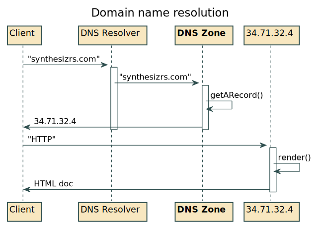
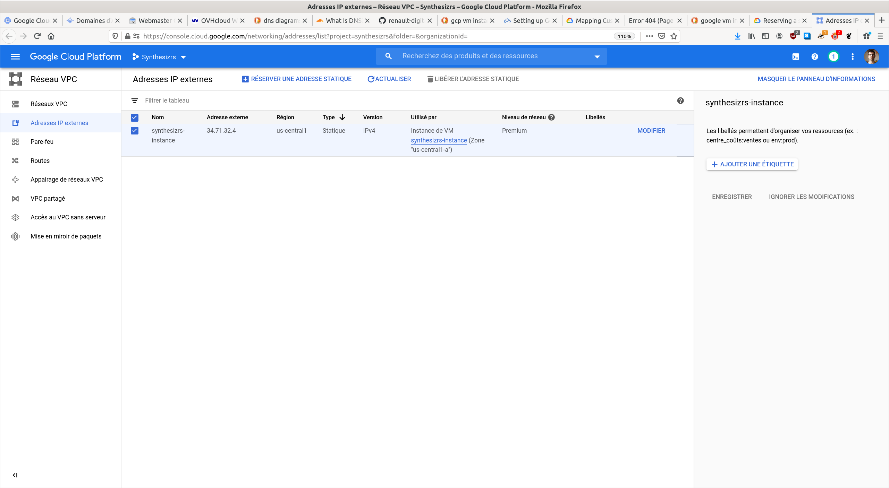
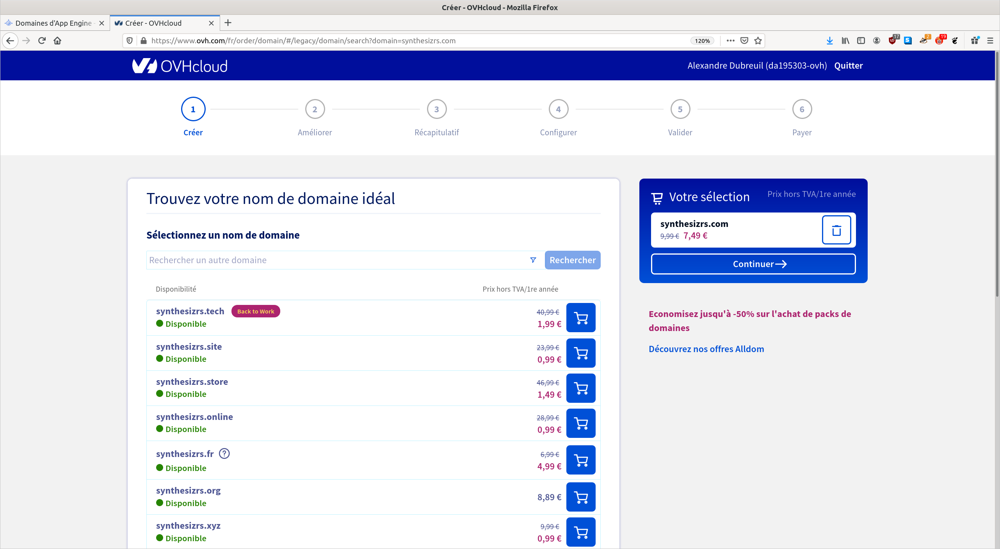
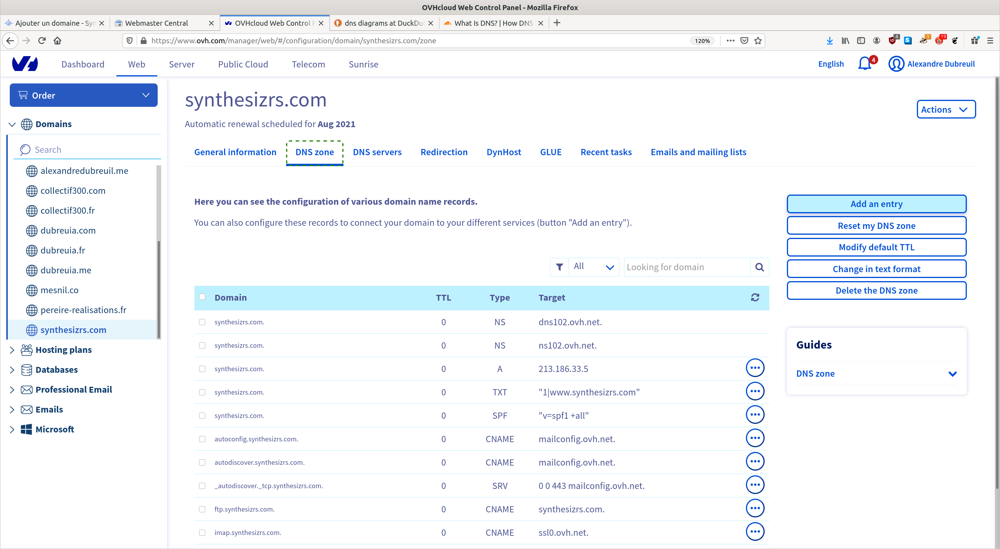
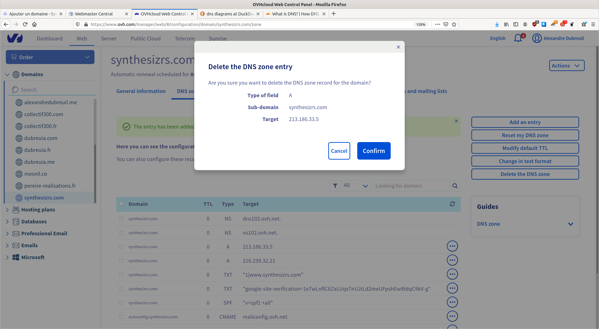
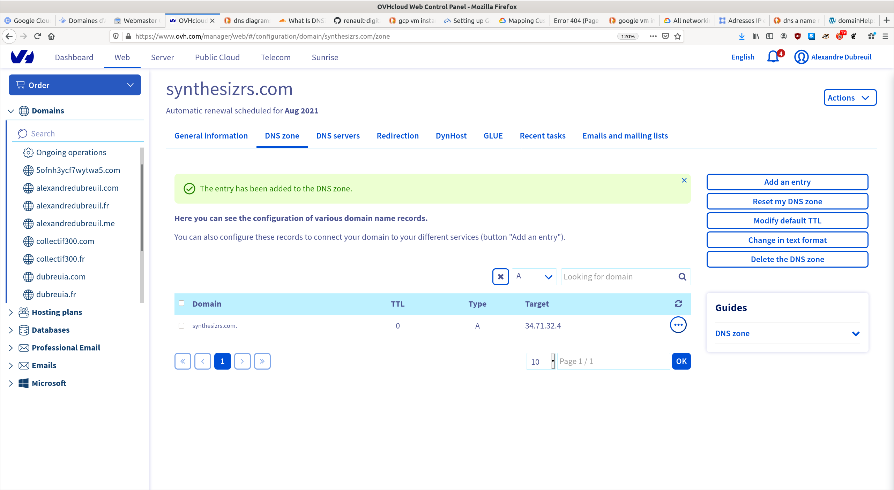
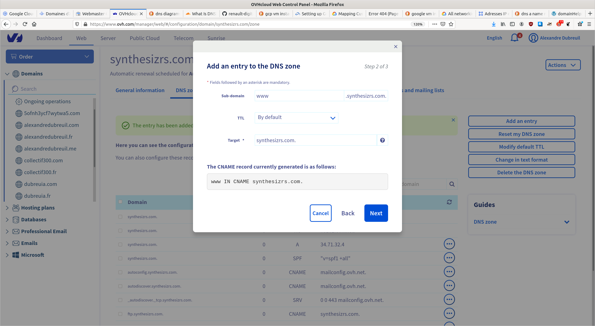

# Workshop 7 - Ajouter son nom de domaine

Maintenant que votre site web est en ligne grâce à [Workshop 7 - Ajouter son nom de domaine monchefdoeuvre.com](7-custom-domain), nous pouvons ajouter un nom de domaine, par example [synthesizrs.com](synthesizrs.com), au lieu de votre adresse IP, par example [http://34.71.32.4/](http://34.71.32.4/). Pour cela il faut:

- Réserver une adresse IP statique
- Acheter un domaine
- Configurer un domain name server (DNS) pour faire pointer votre domain vers votre adresse IP

## Introduction sur les DNS

Référence :

- [What Is DNS? | How DNS Works](https://www.cloudflare.com/learning/dns/what-is-dns/): DNS is what lets users connect to websites using domain names instead of IP addresses. Learn how DNS works.

Diagramme :

La partie qu'on configure est la partie **"DNS Zone" (dans Google Domains, dans OVH domaines, etc.)**. Dans la zone DNS, on va ajouter un "A record" (entrée de type A), qui est la configuration qui traduit le domaine vers une addresse IP.

## Réserver une address IP statique

- (GCP) Si vous avez déjà une addresse IP pour votre VM Instance : https://cloud.google.com/compute/docs/ip-addresses/reserve-static-external-ip-address?hl=fr#promote_ephemeral_ip
- (GCP) Sinon : https://cloud.google.com/compute/docs/ip-addresses/reserve-static-external-ip-address?hl=fr#reserve_new_static

## Acheter un domaine

- (OVH) Vous pouvez acheter votre domaine sur Google Domains, ou ailleurs (OVH, Hover, etc.). Il y a actuellement des promos chez OVH, cet example utilise OVH.

## Configurer un domaine name server (DNS)

1. (OVH) Configurer les zones DNS pour votre domaine
    
2. (OVH) Supprimer les A records existants 

3. (OVH) Ajouter un A record qui pointe vers votre adresse IP statique 

4. (OVH) Ajouter un redirect DNS de www vers votre domaine 

La propagation DNS prend plusieurs heures, au maximum 2 jours. Revenez plus tard pour tester!
