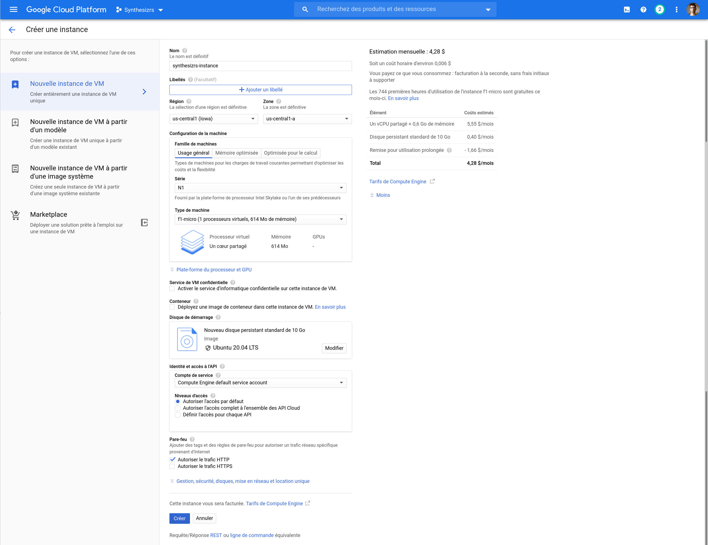
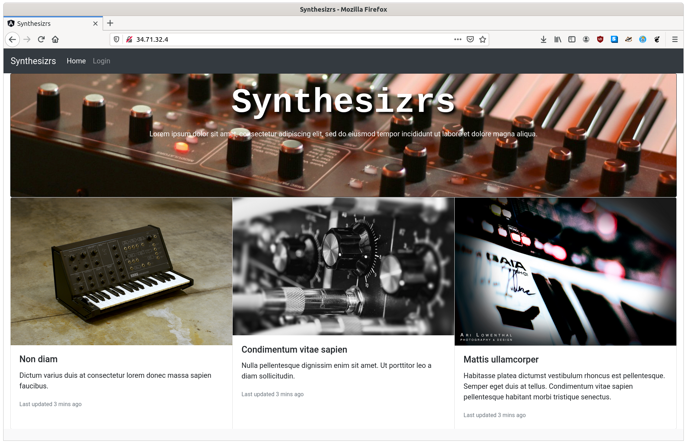

# Workshop 2 : Déployer son chef d'oeuvre

Le but de ce workshop est de déployer la landing page produite pendant le dernier atelier sur Google Cloud Platform (GCP) afin de préparer l'oral blanc.

## Créer son compte

- Aller sur https://console.cloud.google.com/getting-started
- Créer son compte, vous deviez obtenir 300$ gratuit si c'est votre 1e compte (pas nécessaire)

## Créer un nouveau projet GCP

- Aller sur la création de projet https://console.cloud.google.com/projectselector2/home/dashboard
- Cliquer sur "Créer un projet", nommer le (ex. "Synthesizrs")
- Télécharger le "SDK Cloud", suivre les instructions par plateforme
- Ensuite `gcloud init`, suivre les instruction
- Choisir son projet, si vous avez beaucoup de projets, il faudra entrer l'id (ex. synthesizrs)

## Créer une nouvelle instance VM gratuite

GCP : https://cloud.google.com/free/ (1 instance f1-micro + 30 Go disk)

Référence : https://medium.com/@hbmy289/how-to-set-up-a-free-micro-vps-on-google-cloud-platform-bddee893ac09 

- Aller dans "Compute Engine" puis "Instance de VM", cliquer sur "Créer une instance"
    - Noter le nom (ex. "synthesizrs-instance")
    - Région il faut prendre une région aux US (gratuit) 
    - Dans "Type de Machine", choisir "f1-micro" (gratuit)
    - Vérifier qu'à droite vous avez "Les 744 premières heures d'utilisation de l'instance f1-micro sont gratuites ce mois-ci."
    - Dans "Disque de démarage" faire "Modifier" puis prendre "Ubuntu" et "Ubuntu 20.04 LTS"
    - Changer la taille du disque pour 30 Go (gratuit)
    - Dans "Pare-feu" cocher "Autoriser le traffic HTTP"
- Attention vous n'avez pas droit a 2 instances gratuites.

## Upload de son frontend sur GCP

- Faire un packaging de production de votre application
    - Pour Angular : `ng build --prod --output-path angularapp`
    - Pour React : TODO
    - Pour Vue.js : TODO
- Faire un tar du dossier contenant votre app
    - Pour Angular : `tar cf angularapp.tar angularapp`
    - Pour React : TODO
    - Pour Vue.js : TODO
- Transférer le tar sur votre VM
    - Lorsque le gcloud se connecte pour la première fois en SSH, il va créer une clef SSH, et vous demander un mot de passe pour cette clef
    - Pour Angular : `gcloud compute scp angularapp.tar synthesizrs-instance:app.tar`
    - Pour React : TODO
    - Pour Vue.js : TODO
- Se connecter à son instance : `gcloud beta compute ssh --zone "us-central1-a" "synthesizrs-instance" --project "synthesizrs"`
    - Installer nginx sur l'instance : `sudo apt install nginx`
    - Extraire son app : `taf xf app.tar`
    - Copier son app dans le dossier racine de nginx :
        - Pour Angular : `sudo cp -R angularapp/* /var/www/html`
        - Pour React : TODO
        - Pour Vue.js : TODO
- Aller dans "Compute Engine" puis "Instance de VM", cliquer sur "Adresse IP externe"

## Ajouter son propre nom de domaine

- Faire la documentation https://cloud.google.com/appengine/docs/standard/python/mapping-custom-domains
- Aller sur https://domains.google/, acheter le domaine, le lier à l'instance VM
