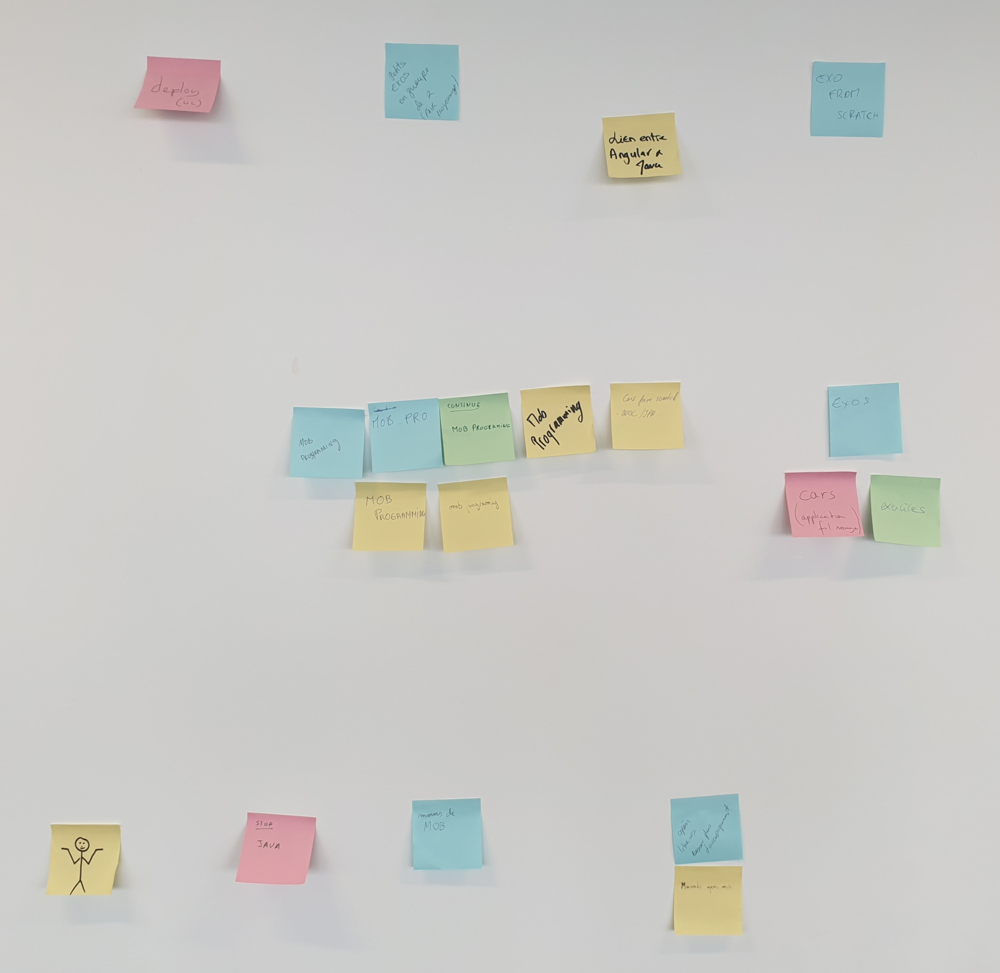
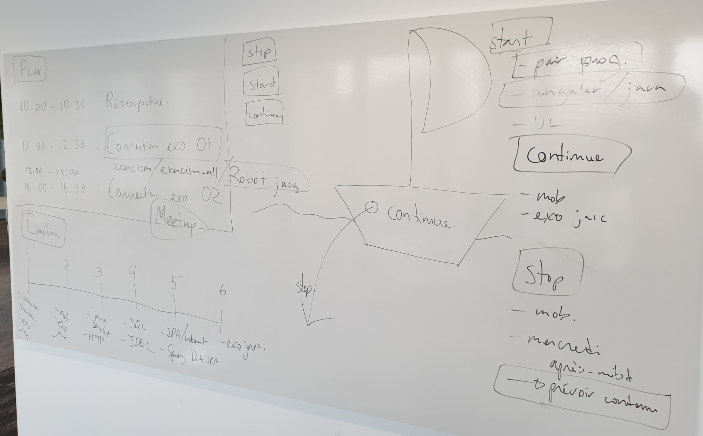

# Semaine 06 - 17/18/19 février

## Plan

- Feuille émargement
- Rétrospective
- Retour sur [semaine passé](../semaine05/README.md) (30 minutes)
- Mob programming sur [exercism](../../exercices/exercism-all) (120 minutes)
- Mercredi: mob programming sur [exercism](../../exercices/exercism-all) (240 minutes)
    - exercism-all: io.exercism.Robot
    - exercism-all: io.exercism.Meetup

## Rétrospective

- Start
    - TODO pair prog
    - TODO angular / java
- Continue
    - Mob programing
    - Exo java
- Stop
    - Mob (diversifier)
    - TODO mercredi après-midi sans contenu

