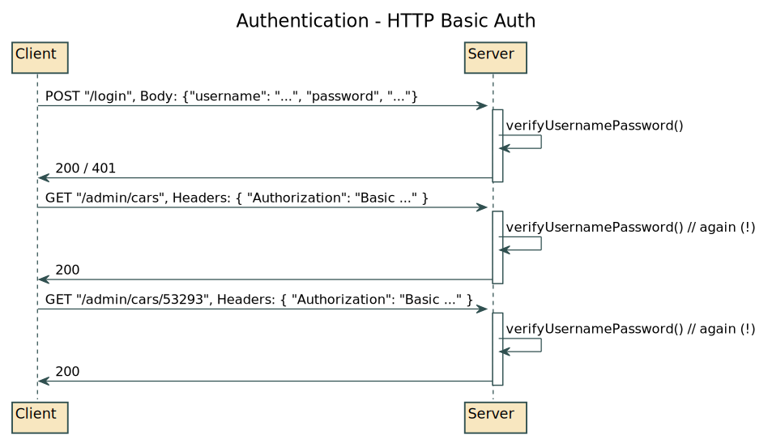
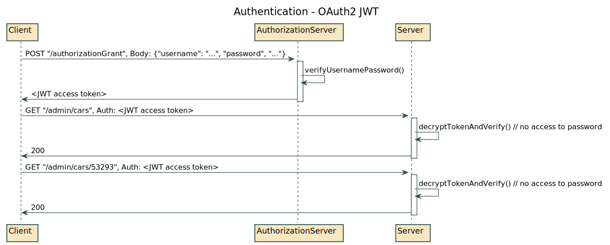
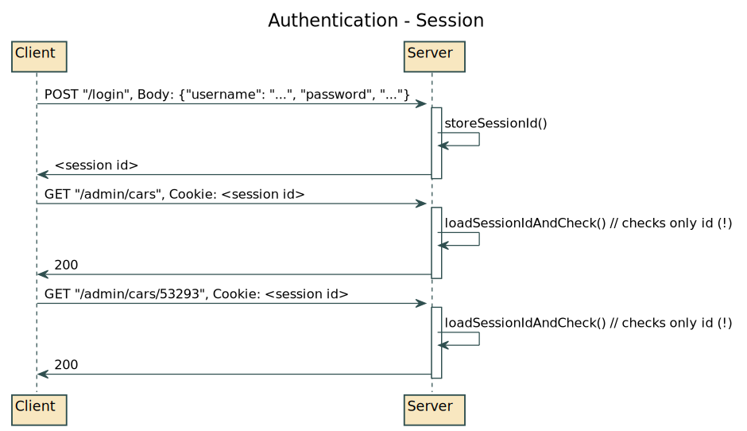

# Sessions

## Gestion de l'authentification

L'authentification a pour but d'identifier un client à un serveur. Nous distinguons plusieurs types d'authentification sur le web, principalement : à base de username / password (HTTP Basic Auth), à base de token (OAuth2 / JWT), ou à base de session (cookie). Nous allons aujourd'hui voir **l'authentification par session**.

### Authentification - HTTP Basic Auth

Cette authentification est **stateless** (sans état), ce qui permet aux serveurs de ne pas garder d'information sur les clients (chaque requête est indépendante). Très utile pour REST. Sécure que si HTTPS est utilisé (TLS over HTTP) pour chiffrer les headers qui contiennent le username et mot de passe en clair (https://www.baeldung.com/spring-security-basic-authentication).

Ce sujet a déjà été vu sur le projet Cars : [Step 8 - Ajout de l'authentification](https://github.com/simplonco/renault-digital-2020-projet#step-8---ajout-de-lauthentification)

### Authentification - OAuth2 JWT

Cette authentification est utile lorsque plusieurs applications doivent vérifier l'identité d'un même client : chaque application ne peut pas avoir une copie du mot de passe! Un serveur central vérifie l'identité, retourne un token, qui peut-être validé que par les applications qui ont validé ce serveur central (https://www.baeldung.com/spring-security-oauth2-jws-jwk).

Ce sujet a déjà été vu avec Frank : [application people](https://github.com/Frank-readresolve/people)

### Authentification - Session

Cette authentification est "historique" et très simple : lorsque le serveur authentifie un utilisateur avec son mot de passe, il génère un **session id** pour cet utilisateur qu'il lui retourne. Ce "session id" est renvoyé au serveur à chaque requête grâce aux cookies (les cookies sont renvoyés automatiquement à chaque requête pour un domaine donné, https://www.tutorialspoint.com/javascript/javascript_cookies.htm). Le serveur ne vérifie que le session id. Cela permet aussi d'associer à un session id du contenu ! Par exemple un utilisateur a vu tel nombre de page, etc. Le session id est stocké en mémoire, sur disque, dans un cache, ou en BDD.

## Exercice

Pour faire les exercies, exécuter `npm install` dans ce dossier, pour installer Express et quelques utilitaires.

- **[Exercice 1](./exercice_page_count.js)** : Imprimer "vous avez vu cette page x fois" dans la page
    - Vous allez devoir stocker en session un compteur, utiliser `req.session` pour acceder a la session
    - Vous pouvez écrire / lire dans la session
    - Que ce passe-t-il si vous utilisez plusieurs onglets ? La valeur est la même ? Pourquoi ?
    - Et si vous utilisez plusieurs navigateurs, que ce passe-t-il ? Pourquoi ?
    - Ou est stocké le session id côté client? Comment le navigateur renvoie-t-il le session id au serveur ?
- **[Exercice 2](./exercice_page_count_multiple.js)** : Imprimer "vous avez vu cette page x fois" dans 2 pages différentes, nommées "page1" et "page2"
- **[Exercice 3](./exercice_page_count_on_disk.js)** : Répéter l'exercice 1
    - Les sessions sont maintenant stockées sur disque, que contiennent-t-elles ?
    - Les sessions étaient stockés à quel endroit dans l'exercice 1 ?
    - Dans un système de production, ou sont stockés les sessions ?
- **[Exercice 4](./exercice_admin.js)** : Utilisez ce que vous avez appris pour faire de l'authentification à base de session
    - Utiliser le formulaire déjà prêt pour envoyer le username et password
    - Dans la route "/login", valider que le username est "admin" et la password est "password"
    - Dans un système de production, que devriez-vous utiliser pour valider ces valeurs ?
    - Dans la route "/admin", afficher "Bonjour <utilisateur>" avec le nom d'utilisateur, ou "Logguer vous en premier" si l'utilisateur n'a pas de session
    - Dans la route "/logout", supprimer la session de l'utilisateur, vous pouvez utiliser `req.session.destroy`
