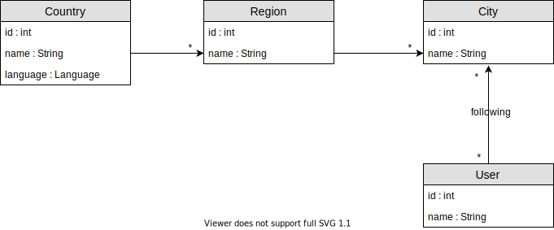

# Cities

## Installation

En utilisant MySQL:

- Installer [docker](https://www.docker.com/get-started)
- Exécuter la dernière image mysql `docker run --name mysql_renault -e MYSQL_ROOT_PASSWORD=12345 -d mysql:latest`
- S'assurer que l'image "mysql_renault" s'exécute avec `docker ps` (copier / coller le port dans application.yml)
- Trouver l'IP du container docker `docker inspect mysql_renault` (copier / coller le port dans application.yml)

En utilisant Postgresql

- Utiliser l'installation de Frank (mettre les bonnes valeurs dans application.yml)

## Démarrer le serveur

Configurer la bdd dans [application.yml](./src/main/resources/application.yml) avec la bdd choisie. Démarrer le serveur Spring Boot ([http://localhost:8008](http://localhost:8008)):

```bash
# Linux & MacOS
./gradlew bootRun

# Windows
gradlew bootRun
```

## Exécuter les tests

Des tests unitaires vérifie que vos endpoints REST fonctionnent correctement. Pour les exécuter :

```bash
# Linux & MacOS
./gradlew test

# Windows
gradlew test
```

## Exercice

Pour travailler les relations, les transactions, et revoir les contrôleurs, nous allons développer l'application "cities", qui met en relation des pays, régions, et villes. Des utilisateurs peuvent "follow" des villes :



Le backend est à développer en TDD : chaque test unitaire vérifie le bon fonctionnement des différentes parties. Lors de la journée en commun du mercredi, nous allons ajouter le frontend nécessaire pour appeler le backend.

### Partie 0 - `Language` - Échauffement

Un énuméré `Language` a été créé et sera utile pour les pays plus tard. Créer un REST controlleur avec les URLs suivants:

- "/language" (GET) : retourne la liste des langues, avec leur "name", et non leur "code" (par example : {"French", "English", ...})

Vérification :

- Exécuter le test `Part0LanguageTest`

### Partie 1 - `Country` - Introduction

Créer une nouvelle entitée `Country` avec les propriétés suivantes :

- id (`int`) NOT NULL PRIMARY KEY
- name (`String`) NOT NULL
- language (`Language`) NOT NULL

Créer un REST controlleur avec les URLs suivants:

- "/country" (GET) : retourne la liste de pays
- "/country/{id}" (GET) : retourne le pays pour cet id
- "/country" (POST) : crée le pays donné
- "/country/{id}" (DELETE) : supprime le pays pour cet id
- "/country/{id}" (PUT) : met à jour le pays donné

Dans `CitiesApplication`, ajouter du contenu au démarrage de l'application :

- Supprimer tout le contenu de la table "country"
- Ajouter les pays "France" et "Canada"

| id        | language      | name     |
| --------- | ------------- | -----    |
| 1001      | "FR"          | "France" |
| 1002      | "EN"          | "Canada" |
| 1003      | "JA"          | "Japan"  |

### Partie 2 - `Region` - Mapping bidirectionnel

Créer une nouvelle entitée `Region` avec les propriétés suivantes :

- id (`int`) NOT NULL PRIMARY KEY
- name (`String`) NOT NULL
- country (`Country`) NOT NULL FOREIGN KEY (see [https://www.baeldung.com/hibernate-one-to-many](https://www.baeldung.com/hibernate-one-to-many))

Dans `Country` ajouter les propriétés suivantes (implémentation d'un mapping "bidirectionel", voir [https://docs.oracle.com/cd/E19798-01/821-1841/bnbqj/index.html](https://docs.oracle.com/cd/E19798-01/821-1841/bnbqj/index.html)) :
 
- regions `List<Region>` (see [https://www.baeldung.com/hibernate-one-to-many](https://www.baeldung.com/hibernate-one-to-many))

Créer un REST controlleur avec les URLs suivants :

- "/country/{countryId}" (POST) : crée la région donnée dans le pays correspondant à l'id donné
- "/country/region" (POST) : crée le pays donné et la région donnée
- "/country/{countryId}/region" (GET) : retourne les régions pour le pays correspondant à l'id donné
- "/country/region/{id}" (GET) : retourne la région correspondant à l'id donné

Puisque la `Region` a une clef étrangère qui référence un `Country`, vous allez devoir insérer le pays avant, dans une transaction:

- Erreur commune: `java.sql.SQLIntegrityConstraintViolationException: Column 'country_id' cannot be null`
- Annoter la méthode dans le service avec `@Transactional` [https://dzone.com/articles/how-does-spring-transactional](https://dzone.com/articles/how-does-spring-transactional)
- Sauvegarder le pays, puis sauvegarder la région

Dans `CitiesApplication`, ajouter du contenu au démarrage de l'application :

- Supprimer tout le contenu de la table "region"
- Ajouter la région "IDF" pour le pays "France"
- Ajouter la région "Québec" pour le pays "Canada"

| id        | name     | country_id    |
| --------- | -------- | ------------- |
| 2001      | "IDF"    | 1001          |
| 2002      | "Québec" | 1002          |

Questions :

- Quelle est l'utilité d'une transaction ?
    - Dans le cas général (notre cas d'usage)
    - Dans le cas ou l'une des opérations est en échec
- Supprimer le pays "France" (en utilisant une méthode du contrôleur)
    - Que se passe-t-il ?
    - Et en ajoutant `@OneToMany(mappedBy = "country", cascade = CascadeType.REMOVE)` ?
    - Voir [https://www.baeldung.com/jpa-cascade-types](https://www.baeldung.com/jpa-cascade-types)
- Faire une requête pour récupérer la région "Québec" (en utilisant une méthode du contrôleur)
    - Combien de requêtes sont nécessaires pour récupérer cette région ? Pourquoi ?
    - À quel moment est-ce que cette requête se produit ?
    - Et en ajoutant `@OneToMany(mappedBy = "country", fetch = FetchType.EAGER)` ?
    - Et en ajoutant `@Fetch(value = FetchMode.SELECT)` ?
    - Voir [https://www.baeldung.com/hibernate-fetchmode#fetchmode-vs-fetchtype](https://www.baeldung.com/hibernate-fetchmode#fetchmode-vs-fetchtype)

### Partie 3 - `City` - Mapping bidirectionnel

Ajouter les mêmes fonctionnalités que pour région sur un nouvel entité `City`.

Dans `CitiesApplication`, ajouter du contenu au démarrage de l'application :

- Supprimer tout le contenu de la table "city"
- Ajouter la région "Paris" et "Montreuil" pour le pays "France"
- Ajouter la région "Montréal" et "Laval" pour le pays "Canada"

| id        | name        | region_id     |
| --------- | --------    | ------------- |
| 3001      | "Paris"     | 2001          |
| 3002      | "Montreuil" | 2001          |
| 3003      | "Montréal"  | 2002          |
| 3004      | "Laval"     | 2002          |

### Partie 4 - `User` - Association ManyToMany

Créer une nouvelle entité `User`. Un utilisateur pourra "suivre" une ville (si vous n'avez pas fait la partie 3, un utilisateur pourra suivre une région) :

- id (`int`) NOT NULL PRIMARY KEY
- name (`String`) NOT NULL
- followedCities (`List<City`) (see [https://www.baeldung.com/jpa-many-to-many](https://www.baeldung.com/jpa-many-to-many))

Afin d'implémenter `followedCity`, il faut créer une table de jointure, nommée "user_city", qui a 2 colonnes:

- user_id (`int`) PRIMARY KEY FOREIGN KEY
- city_id (`int`) PRIMARY KEY FOREIGN KEY

Créer un REST controlleur avec les URLs suivants :

- "/user" (POST) : crée un nouveau user 
- "/user/{userId}/followCity/{cityId}" (POST) : ajoute pour le user correspondant à l'id, un follow pour la ville correspondant à l'id
- "/user/{userId}/followCity/{cityId}" (DELETE) : supprime pour le user correspondant à l'id, un follow pour la ville correspondant à l'id
- "/user/{userId}/followCity" (GET) : retourne la liste des villes suivies

Dans `CitiesApplication`, ajouter du contenu au démarrage de l'application :

- Supprimer tout le contenu des tables "user" et "user_city
- Ajouter l'utilisateur "alex"
- Pour l'utilisation "alex", ajouter follow sur 2 villes : "Paris" et "Montréal"

Table "user" :

| id        | name        |
| --------- | --------    |
| 4001      | "Alex"     |

Table "user_city" :

| user_id   | city_id     |
| --------- | --------    |
| 4001      | 3001        |
| 4001      | 3002        |

### Partie 5 - `@Valid` - Validation

Dans cette partie, nous allons valider les entité au niveau des entités et de la bdd.

Pour les entités :

- Ajouter les annotations `@NotNull`, `@Length(min = ..., max = ...)` pour `CountryDto`, `RegionDto`, `CityDto`
- Ajouter l'annotation `@Valid` sur les méthodes POST dans `CountryController`, `RegionController`, `CityController`
- Écrire un test qui déclanche une erreur de validation dans `CountryTest`, `RegionTest`, `CityTest`
- La validation peut aussi se faire au niveau du service et de `Country`, `Region`, `City` !

Pour la BDD :

- Ajouter les attributs aux annotations `@Column(nullable = ..., length = ...)` pour `Country`, `Region`, `City`
- Ces attributs nous permettent de générer le SQL de création de bdd !
- Générer le SQL à partir des modèles en ajoutant dans application.yml : `spring.jpa.generate-ddl: true`
- Vérifier le SQL généré (regarder dans la console lorsque l'application démarre) :

```sql
drop table city if exists
drop table country if exists
drop table region if exists
drop table user if exists
create table city (id integer generated by default as identity, name varchar(255), primary key (id))
create table country (id integer generated by default as identity, language varchar(255), name varchar(512) not null, primary key (id))
create table region (id integer generated by default as identity, name varchar(255), country_id integer, primary key (id))
create table user (id integer generated by default as identity, primary key (id))
alter table region add constraint FK7vb2cqcnkr9391hfn72louxkq foreign key (country_id) references country
```

### Partie 6 - Approfondissement

Dans cette partie, nous allons approfondir certains sujets :

- Implémenter le DELETE d'une ville sur l'URL "country/region/city/{cityId}"
    - La suppression doit fonctionner pour une ville qui est suivie par des utilisateurs (pe "Paris")
    - Pour supprimer cette ville, il faut d'abord supprimer la ville dans `user.getFollowedCities()`, pour tous les users qui suivent cette ville
    - Vous pouvez expérimenter avec les `CascadeType`, qui feront des suppressions automatiques
    - Le test suivant doit passer :
    ```java
    public class Part3CityTest extends TestCitiesApplication {
    
        @Test
        public void should_DELETE_city_should_remove_city_even_if_followed() {
            int parisId = getCityIdForName("Paris").orElseThrow();
            delete(format("country/region/city/%s", parisId));
    
            List<String> cityNames = getCityNames();
            assertEquals(3, cityNames.size());
            assertFalse(cityNames.contains("Paris"));
    
            List<String> userNames = getUserNames();
            assertEquals(1, userNames.size());
            assertTrue(userNames.contains("Alex"));
        }
    
    }
    ```

- Implémenter une validation à plusieurs niveaux :
    - La validation doit se faire sur plusieurs objets : sur `CountryRegionDto`, puis en cascade sur `CountryDto` et `RegionDto`
    - Le test suivant doit passer :
    ```java
    public class Part5ValidationTest extends TestCitiesApplication {
    
        @Test
        public void should_POST_root_region_name_too_short_validation_fails() {
            JsonObject badRegionName = Json.createObjectBuilder()
                    .add("country", Json.createObjectBuilder()
                            .add("name", "United Kingdom")
                            .add("language", "English")
                            .build())
                    .add("region", Json.createObjectBuilder()
                            .add("name", "ff")
                            .build())
                    .build();
            HttpStatus status = assertThrows(ResponseStatusException.class, () -> post("country/region", badRegionName))
                    .getStatus();
            assertEquals(BAD_REQUEST, status);
  
            List<String> countryNames = getCountryNames();
            assertEquals(3, countryNames.size());
  
            List<String> regionNames = getRegionNames();
            assertEquals(2, regionNames.size());
        }
    
    }
    ```

## Outline content (draft)

- spring web
    - context web : https://www.baeldung.com/spring-web-contexts
- hibernate / jpa
    - add @enumerated
    - @NotNull vs @Column(nullable) : https://www.baeldung.com/hibernate-notnull-vs-nullable
    - spring.jpa.hibernate.ddl-auto=create-drop
    - persistance context : https://www.baeldung.com/jpa-hibernate-persistence-context
        - entity manager : root manager
        - entity manager : isDirty
        - transaction scope vs extended scope
        - transaction scope : all component share same ctx
        - make example on that : https://github.com/eugenp/tutorials/tree/master/persistence-modules/hibernate5-2
        - session factory / save / refresh / flush / contains / dirty
        - refresh : reread, usefull for a clear
        - failed to lazily initialize a collection of role: User.followedCities, could not initialize proxy - no Session
    - unidirectionnal mapping : https://docs.oracle.com/cd/E19798-01/821-1841/bnbqk/index.html
    - bidirectionnal mapping : https://docs.oracle.com/cd/E19798-01/821-1841/bnbqj/index.html
    - one-to-one : https://www.baeldung.com/jpa-one-to-one
        - owning side : object, referencing side : object
        - @JoinColumn : owning side only
        - join table can be used
    - one-to-many : https://www.baeldung.com/hibernate-one-to-many
        - owning side : list, referencing side : object
        - owning side on the many side with mappedBy
        - owning side on the one side with @JoinColumn
        - owning side : https://www.baeldung.com/jpa-joincolumn-vs-mappedby
        - lazy eager : https://www.baeldung.com/hibernate-lazy-eager-loading
        - use transactions
    - many-to-many : https://www.baeldung.com/jpa-many-to-many
        - also : https://www.baeldung.com/hibernate-many-to-many
        - owning side : list, referencing side : list
        - join table with an attribute
            - https://www.baeldung.com/jpa-many-to-many#many-to-many-using-a-composite-key
            - https://www.baeldung.com/jpa-many-to-many#many-to-many-with-a-new-entity
            - new entity way simpler
        - step 1 : fave city, step 2 : fave city with rating
    - fetchmode : https://www.baeldung.com/hibernate-fetchmode
        - select vs batch size
        - join fetch (eager only)
        - https://www.baeldung.com/hibernate-fetchmode#fetchmode-vs-fetchtype
    - cascading : https://www.baeldung.com/jpa-cascade-types
        - TODO
    - spring object mapping : https://www.baeldung.com/entity-to-and-from-dto-for-a-java-spring-application
        - TODO
